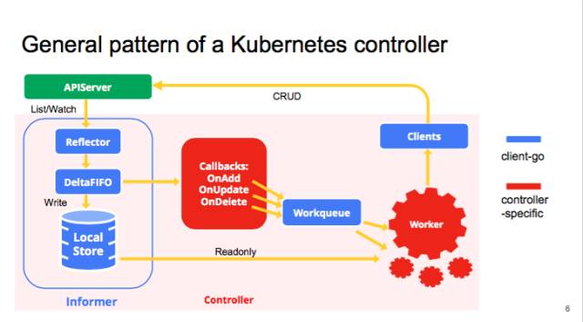

<!--
 * @Author: jinde.zgm
 * @Date: 2021-03-05 21:44:34
 * @Description: 
-->

# 前言

Controller，中文翻译是控制器。本文的Controller是SharedIndexInformer的控制器，不是kube-controller-manager的控制器，所以千万不要搞混概念，虽然他们都叫控制器。

既然叫控制器，那么它控制什么呢？还记得这个经典的图片么？



Controller就是负责从Reflector接手Deltas并发送到DeltaFIFO的过程，看起来确实控制了Deltas的流动。此图中红色的controller是kube-controller，不是本文的Controller。

本文采用kubenete的release-1.20分支。

# Controller定义

源码连接：<https://github.com/kubernetes/client-go/blob/release-1.20/tools/cache/controller.go#L98>

```go
type Controller interface {
    // Run主要做两件事情：1）创建并运行Reflector，从Config.WatcherLister列举/监视并发送到Config.Queue，可能周期性的调用Queue.Resync()
    // 2）持续从Queue弹出对象增量并调用Config.ProcessFunc。这两个事情都是通过独立的协程运行直到stopC关闭
    // 关于Config后文有注释
    Run(stopCh <-chan struct{})

    // 这个函数会给SharedIndexInformer使用，目的是判断当前是否已经同步完成了。同步的意思就是至少完成了一次全量列举
    HasSynced() bool

    // 获取上一次同步的版本，这个版本是列举全量对象的最大版本号
    LastSyncResourceVersion() string
}
```

单纯的从Controller的定义上看，确实起到了控制器的作用，至少它在驱动数据流动，包括全量列举、监视增量已经定时的在同步。

# Controller实现

## Config

Config是Controller的配置，在创建Controller时使用，以此来配置Controller。源码连接：<https://github.com/kubernetes/client-go/blob/release-1.20/tools/cache/controller.go#L39>

```go
type Config struct {
    // 队列，当前实现为DeltaFIFO
    Queue

    // ListerWatcher用来创建Reflector
    ListerWatcher

    // 处理从Queue中弹出的增量(Deltas)的函数，ProcessFunc下面有注释
    Process ProcessFunc

    // 对象类型，比如v1.Pod，说明SharedIndexInformer是每个API类型都需要创建一个
    ObjectType runtime.Object

    // 在同步的周期，再同步不是同步apiserver，是Queue与Indexer、ResourceEventHandler之间的在同步
    FullResyncPeriod time.Duration

    // 是否需要再同步的函数，如果没有任何ResourceEventHandler设置resyncPeriod，则不需要在同步
    // ShouldResyncFunc下面有注释
    ShouldResync ShouldResyncFunc

    // 如果为true，当调用Process()返回错误时，重新放回Queue
    RetryOnError bool

    // 用来创建Reflector，每个Reflector.ListAndWatch()断开连接并出现错误时调用这个函数
    WatchErrorHandler WatchErrorHandler

    // 初始化监视列表和重新列举全量对象的请求块大小，说白了就是用来分页列举的，与SQL中的limit类似
    WatchListPageSize int64
}

// ShouldResyncFunc是一种函数类型，该类型的函数需要告知是否需要再同步，函数实际指向了sharedProcessor.shouldResync().
// 关于sharedProcessor.shouldResync()请参看SharedIndexInformer的文档
type ShouldResyncFunc func() bool

// ProcessFunc从定义上看是处理一个对象的函数类型，函数实际指向了sharedIndexInformer.HandleDeltas()，所以对象就是Deltas
// 关于sharedIndexInformer.HandleDeltas()请参看SharedIndexInformer的文档
type ProcessFunc func(obj interface{}) error
```

从Config的成员变量可以看出，Controller需要ListerWatcher、Queue、ProcessFunc，这基本上算是SharedIndexInformer的数据流，从ListerWatcher->Queue->ProcessFunc，所以称之为控制器名副其实。

## controller

controller是Controller的实现，这种定义方式已经是golang不成文的规则了。源码连接：<https://github.com/kubernetes/client-go/blob/release-1.20/tools/cache/controller.go#L89>

```go
type controller struct {
    // Config不用多说了，上一个章节介绍过了
    config         Config
    // Reflector请参看Reflector的文档
    reflector      *Reflector
    // 后面两个应该没什么好解释的了
    reflectorMutex sync.RWMutex
    clock          clock.Clock
}
```

从controller的定义上看，基本等于Config+Reflector，不能再多了。

### Run()接口实现

Run()是controller非常核心的函数，因为controller的核心功能点都是在这里开始的，也就是说在controller的构造函数中没有做太多的工作，读者可以自行了解。因为controller是[SharedIndexInformer](./SharedIndexInformer.md)的核心，所以controller.Run()必然在SharedIndexInformer.Run()执行的。

源码连接：<https://github.com/kubernetes/client-go/blob/release-1.20/tools/cache/controller.go#L127>

```go
func (c *controller) Run(stopCh <-chan struct{}) {
    defer utilruntime.HandleCrash()
    // 如果收到停止信号，需要把Queue关闭掉，此处有一个疑问：有必要卡一个协程等待信号然后关闭Queue么？
    // 直接在函数的结尾关闭不行么？毕竟函数需要等待停止型号并且Run()退出后才结束。
    // 其实在DeltaFIFO的文档中介绍过了，DeltaFIFO.Pop()通过sync.Cond阻塞协程，
    // 此时stopCh关闭也不会激活阻塞的协程，除非有新的对象或者关闭Queue
    // 所以常见一个协程关闭Queue是非常有必要的，否则就和controller.processLoop(后面章节会介绍)形成死锁了
    go func() {
        <-stopCh
        c.config.Queue.Close()
    }()
    // 创建Reflector，需要注意的是传入了ListerWatcher、Queue、FullResyncPeriod，在Reflector文章中提到了：
    // 1.通过ListerWatcher同步apiserver的对象；
    // 2.定期的调用Queue.Resync()；
    r := NewReflector(
        c.config.ListerWatcher,
        c.config.ObjectType,
        c.config.Queue,
        c.config.FullResyncPeriod,
    )
    // 感情Config中的大部分参数都是给Reflector的...
    r.ShouldResync = c.config.ShouldResync
    r.WatchListPageSize = c.config.WatchListPageSize
    r.clock = c.clock
    if c.config.WatchErrorHandler != nil {
        r.watchErrorHandler = c.config.WatchErrorHandler
    }

    // 记录Reflector
    c.reflectorMutex.Lock()
    c.reflector = r
    c.reflectorMutex.Unlock()

    var wg wait.Group
    // 启动协程运行Reflector.Run()
    wg.StartWithChannel(stopCh, r.Run)
    // 启动协程运行processLoop()函数，虽然wait.Util()是每一秒执行一次processLoop()，但是processLoop()内部是一个死循环直到Queue关闭。
    // 初期的设计应该是遇到错误一秒后再重试，直到收到停止信号，现在来看只有Queue关闭的错误processLoop()才会退出。
    // 其他的错误当Config.RetryOnError为true时，会重新放入Queue，否则就丢弃，所以用wait.Until()当前的版本来看没有意义。难道Queue关闭了还会重新创建不成？
    wait.Until(c.processLoop, time.Second, stopCh)
    // 当前来看，只等待运行Reflector.Run()函数的协程退出
    wg.Wait()
}
```

### 其他接口实现

源码连接：<https://github.com/kubernetes/client-go/blob/release-1.20/tools/cache/controller.go#L158>

```go
// HasSynced实现了Controller.HasSynced()，无非是对Queue.HasSynced()的在封装
func (c *controller) HasSynced)() bool {
    return c.config.Queue.HasSynced()
}

// LastSyncResourceVersion无非是对Reflector.LastSyncResourceVersion()的再封装
func (c *controller) LastSyncResourceVersion() string {
    c.reflectorMutex.RLock()
    defer c.reflectorMutex.RUnlock()
    if c.reflector == nil {
        return ""
    }
    return c.reflector.LastSyncResourceVersion()
}
```

### controller的核心处理函数processLoop()

源码连接：<https://github.com/kubernetes/client-go/blob/release-1.20/tools/cache/controller.go#L181>

```go
// processLoop才是controller真正所事情的函数
func (c *controller) processLoop() {
    for {
        // 从Queue中弹出对象并交给Config.ProcessFunc()处理
        obj, err := c.config.Queue.Pop(PopProcessFunc(c.config.Process))
        if err != nil {
            // 如果是队列关闭错误，直接退出，因为队列关闭可能收到了停止信号，所以需要退出
            // 如果没有收到停止信号关闭了Queue也没问题，processLoop是周期性调用的，1秒过后还会被调用
            if err == ErrFIFOClosed {
                return
            }
            // 如果配置了错误重试，那么就把对象重新放回队列
            if c.config.RetryOnError {
                c.config.Queue.AddIfNotPresent(obj)
            }
        }
    }
}
```

就这么简答，是不是有一种说自己是核心但是没做啥事的感觉。

# 总结

1. Controller是SharedIndexInformer的控制器，是核心模块，控制API对象从WatcherLister->Queue->ProcessFunc;
2. 虽然Controller看似控制整个数据流程，但是WatcherLister->Queue是Reflector实现的，Controller只是负责创建Reflector并运行它；
3. Controller实际上只实现了Queue->ProcessFunc；
4. 遍地的Controller，都是控制器，重点要看控制啥的，别和kube-controller搞混了，命名需谨慎啊！我有个前同事，就是喜欢命名各种Manager，我也是服了...
