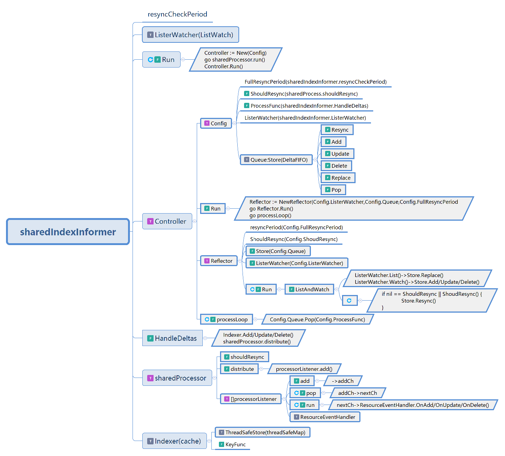

<!--
 * @Author: jinde.zgm
 * @Date: 2021-03-03 22:37:07
 * @Description: ShareIndexInformer源码分析
-->

# sharedIndexInformer流程

流程图注释如下:

* 圆角矩形为类型名，代表有该类型的成员变量。灰色T为interface，紫色T为struct
* 矩形为函数，带有F标记，带有旋转标记为协程函数
* 下划线为成员变量，该变量类型一般不在cache包内，带有F标记为函数型成员变量
* 平行四边形为伪代码，伪代码，伪代码，重要的事情说三遍

执行流程：

1. NewSharedIndexInformer()创建SharedIndexInformer时传入参数defaultEventHandlerResyncPeriod设置sharedIndexInformer.resyncCheckPeriod;
2. sharedIndexInformer.Run()创建Controller对象，通过Config传入resyncCheckPeriod，DeltaFIFO，HandelDeltas，shouldResync等，创建协程运行sharedProcessor.run(),进入Controller.Run()函数;
3. Controller.Run()利用Config的FullResyncPeriod，Queue，ListerWatcher等创建Reflector,创建协程运行Reflector.Run()和Controller.processLoop();
4. Reflector.Run()调用ListAndWatch()，利用ListerWatcher.List()将对象通过Replace加入Queue，利用ListerWatcher.Watch()通过Add/Update/Delete操作Queue。同时创建匿名协程函数根据Config.FullResyncPeriod定期执行Queue.Resync，前提时通过ShouldResync判断是否需要Resync；
5. Controller.processLoop()从Queue中弹出Deltas然后调用Config.Process，也就是sharedIndexInformer.HandleDeltas();
6. sharedIndexInformer.HandleDeltas()根据Deltas同步操作Indexer并分发（distribute）到sharedProcessor;
7. sharedProcessor.distribute()会调用processorListener.add()将delta通知到所有的processorLister，processorListener最后负责通知到所有注册的ResourceEventHandler；
