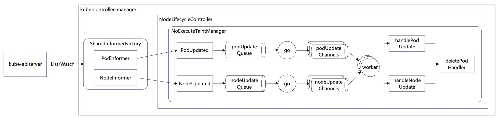

<!--
 * @Author: jinde.zgm
 * @Date: 2022-06-18 11:47:21
 * @Description: NodeLifecycleController(Kubernetes)的NoExecuteTaintManager源码解析
-->

# 前言

关于污点请阅读[《污点和容忍度》](https://kubernetes.io/zh-cn/docs/concepts/scheduling-eviction/taint-and-toleration/)了解基础概念，便于理解本文关于NodeLifecycleController如何管理节点污点的内容。

需要强调的是，本文的污点指的是NoExecute污点，这种污点会驱逐已经运行的pod，这可以从NoExecute字面意思看的出来。[《kube-scheduler调度插件》](../../kube-scheduler/Plugin.md)的TaintToleration在Filter阶段会过滤掉pod无法容忍的NoSchedule和NoExecute污点，也就是说调度器不会调度pod到无法容忍污点node上，那NodeLifecycleController管理还要管理NoExecute干什么呢？道理很简单，node的污点会更新，pod的容忍度也会更新，调度器不会因为node的污点以及pod的容忍度的更新重新调度已调度的pod，这需要NodeLifecycleController驱逐无法容忍node污点的pod才能触发调度器重新调度。

本文引用源码为kubernetes的v1.24.2分支。

# 污点管理器

## NoExecuteTaintManager

NoExecuteTaintManager是NoExecute污点管理器，用于管理具有NoExecute污点的node，并驱逐无法容忍这些污点的pod。NoExecuteTaintManager的定义参看源码链接：<https://github.com/kubernetes/kubernetes/blob/v1.24.2/pkg/controller/nodelifecycle/scheduler/taint_manager.go#L83>

```go
type NoExecuteTaintManager struct {
    // 需要clientset一般有两个目的：
    // 1. 更新资源，比如Update、Patch、Delete等，很多controller在调和过程中需要更新资源；
    // 2. 获取比cache中更新版本的资源，因为clientset的Get()接口需要访问apiserver；
    // 遗憾的是，NoExecuteTaintManager没有使用clientset
    client                clientset.Interface
    // 笔者的习惯是Event相关的内容不做解释，后文所有关于event相关的代码笔者都不会注释
    recorder              record.EventRecorder
    // 下面三个函数是NodeLifecycleController注入的函数：
    // getPod:从cache获取Pod
    // getNode:从cache获取Node
    // getPodsAssignedToNode:从cache中获取调度到指定node的pods
    // 注入函数在单元测试时非常好用，因为可以注入预设的函数来判断函数执行结果是否符合预期
    getPod                GetPodFunc
    getNode               GetNodeFunc
    getPodsAssignedToNode GetPodsByNodeNameFunc

    // taintEvictionQueue是驱逐pod的队列，队列中都是等待驱逐的pod.
    // 驱逐pod的原因很简单，就是pod无法容忍NoExecute污点，就需要将其驱逐.
    // TimedWorkerQueue的实现非常简单，建议读者自行阅读代码，此处笔者只做一些简单的解释，便于后文的源码理解.
    // TimedWorkerQueue有Timed关键字说明有时间属性，这和pod容忍度中容忍时间有关，简单一句话就是过一段时间后再驱逐.
    // 所以taintEvictionQueue中都是等待容忍超时的pod，一旦容忍时间超时就会被立刻从node上驱逐.
    taintEvictionQueue *TimedWorkerQueue
    // taintedNodes的锁，因为有多个worker协程同时处理node的更新事件，存在并发访问taintedNodes的可能性
    taintedNodesLock sync.Mutex
    // taintedNodes记录了具有NoExecute污点的节点，key是节点的名字，value是NoExecute的污点.
    taintedNodes     map[string][]v1.Taint

    // 下面两个chan是NoExecuteTaintManager主协程与worker协程之间通信管道.
    // nodeUpdateChannels用于通知worker协程处理node更新事件.
    // podUpdateChannels用于通知worker协程处理pod更新事件.
    // 因为主协程需要与每个worker协程都要建立chan，所以nodeUpdateChannels和podUpdateChannels是slice类型.
    // 
    nodeUpdateChannels []chan nodeUpdateItem
    podUpdateChannels  []chan podUpdateItem

    // 下面两个队列用于存储node和pod的更新事件，NodeLifecycleController感知(watch)node和pod的更新事件，
    // 并通知给NoExecuteTaintManager，NoExecuteTaintManager将事件存储在相应的队列中，
    // 再通过nodeUpdateChannels和podUpdateChannels分发给worker协程处理。
    nodeUpdateQueue workqueue.Interface
    podUpdateQueue  workqueue.Interface
}
```

## NewNoExecuteTaintManager

前一章节已经解析了NoExecuteTaintManager的定义，本章节对NoExecuteTaintManager的构造函数进行解析，源码链接：<https://github.com/kubernetes/kubernetes/blob/v1.24.2/pkg/controller/nodelifecycle/scheduler/taint_manager.go#L158>

```go
// 构造NoExecuteTaintManager传入getPod、getNode、getPodsAssignedToNode函数，注入到NoExecuteTaintManager对象中。
func NewNoExecuteTaintManager(ctx context.Context, c clientset.Interface, getPod GetPodFunc, getNode GetNodeFunc, getPodsAssignedToNode GetPodsByNodeNameFunc) *NoExecuteTaintManager {
    eventBroadcaster := record.NewBroadcaster()
    recorder := eventBroadcaster.NewRecorder(scheme.Scheme, v1.EventSource{Component: "taint-controller"})
    eventBroadcaster.StartStructuredLogging(0)
    if c != nil {
        klog.V(0).InfoS("Sending events to api server")
        eventBroadcaster.StartRecordingToSink(&v1core.EventSinkImpl{Interface: c.CoreV1().Events("")})
    } else {
        klog.Fatalf("kubeClient is nil when starting NodeController")
    }

    // 创建NoExecuteTaintManager对象，感觉没啥可解释的
    tm := &NoExecuteTaintManager{
        client:                c,
        recorder:              recorder,
        getPod:                getPod,
        getNode:               getNode,
        getPodsAssignedToNode: getPodsAssignedToNode,
        taintedNodes:          make(map[string][]v1.Taint),

        nodeUpdateQueue: workqueue.NewNamed("noexec_taint_node"),
        podUpdateQueue:  workqueue.NewNamed("noexec_taint_pod"),
    }
    // 创建驱逐队列
    tm.taintEvictionQueue = CreateWorkerQueue(deletePodHandler(c, tm.emitPodDeletionEvent))

    return tm
}
```

## Run

构造NoExecuteTaintManager对象后，就要让它运行起来处理node和pod的更新事件，接下来笔者详细的解析NoExecuteTaintManager是如何处理node和pod的更新事件，源码链接：<https://github.com/kubernetes/kubernetes/blob/v1.24.2/pkg/controller/nodelifecycle/scheduler/taint_manager.go#L186>

```go
// Run()是NoExecuteTaintManager的主协程函数
func (tc *NoExecuteTaintManager) Run(ctx context.Context) {
    klog.V(0).InfoS("Starting NoExecuteTaintManager")

    // 为每个worker协程构造node和pod更新的消息管道，UpdateWorkerSize在代码中是常数8，
    // 说明NoExecuteTaintManager有8个worker协程处理node和pod的更新事件
    for i := 0; i < UpdateWorkerSize; i++ {
        tc.nodeUpdateChannels = append(tc.nodeUpdateChannels, make(chan nodeUpdateItem, NodeUpdateChannelSize))
        tc.podUpdateChannels = append(tc.podUpdateChannels, make(chan podUpdateItem, podUpdateChannelSize))
    }

    // 创建一个协程专门负责从nodeUpdateQueue读取更新的node然后再分发到nodeUpdateChannels中
    go func(stopCh <-chan struct{}) {
        for {
            // 从队列中读取一个更新的node
            item, shutdown := tc.nodeUpdateQueue.Get()
            if shutdown {
                break
            }
            // 根据node名字做哈希，就是根据节点名字计算一个int值，然后再取模
            // 这算是一种简单的负载均衡策略
            nodeUpdate := item.(nodeUpdateItem)
            hash := hash(nodeUpdate.nodeName, UpdateWorkerSize)
            // 再将更新node通过chan通知到worker协程，需要注意的是，此处可能会被阻塞，即便chan有buf.
            // 有没有发现这种负载均衡策略是有缺陷的，即可能出现某个worker协程很忙但是还会将更新事件派发给它.
            // 理论上出现这种情况的概率很低，因为chan有buf，但是不排除会发生.
            // 如果做到理想化的负载均衡，势必会增加计算开销，收益不见得比损失大.
            select {
            case <-stopCh:
                tc.nodeUpdateQueue.Done(item)
                return
            case tc.nodeUpdateChannels[hash] <- nodeUpdate:
                // tc.nodeUpdateQueue.Done is called by the nodeUpdateChannels worker
            }
        }
    }(ctx.Done())

    // 创建一个协程专门负责从podUpdateQueue读取更新的pod然后再分发到podUpdateChannels中
    // 因为方法与分发node是一样的，此处就不在多余注释了
    go func(stopCh <-chan struct{}) {
        for {
            item, shutdown := tc.podUpdateQueue.Get()
            if shutdown {
                break
            }
            podUpdate := item.(podUpdateItem)
            hash := hash(podUpdate.nodeName, UpdateWorkerSize)
            select {
            case <-stopCh:
                tc.podUpdateQueue.Done(item)
                return
            case tc.podUpdateChannels[hash] <- podUpdate:
                // tc.podUpdateQueue.Done is called by the podUpdateChannels worker
            }
        }
    }(ctx.Done())

    // 构造worker协程，并发的处理node和pod的更新事件
    // 此处需要注意：每个worker协程都会处理node和pod两种更新事件，而不是为node和pod的更新事件的某一种
    wg := sync.WaitGroup{}
    wg.Add(UpdateWorkerSize)
    for i := 0; i < UpdateWorkerSize; i++ {
        go tc.worker(ctx, i, wg.Done, ctx.Done())
    }

    // 等待所有的worker退出
    wg.Wait()
}
```

从代码上看，NoExecuteTaintManager的主协程主要职责就是pod和node更新事件的负载均衡。

## worker

Run()将pod和node的更新事件通过chan派发到worker协程，本章节解析NoExecuteTaintManager的worker协程是如何处理这两个事件的，源码链接：<https://github.com/kubernetes/kubernetes/blob/v1.24.2/pkg/controller/nodelifecycle/scheduler/taint_manager.go#L244>

```go
// worker()是NoExecuteTaintManager的worker协程函数
func (tc *NoExecuteTaintManager) worker(ctx context.Context, worker int, done func(), stopCh <-chan struct{}) {
    defer done()

    // NoExecuteTaintManager的worker协程就是从nodeUpdateChannels或者podUpdateChannels中获取相应的事件并处理它
    for {
        select {
        // 收到退出信号，退出worker协程
        case <-stopCh:
            return
        // 处理node更新事件
        case nodeUpdate := <-tc.nodeUpdateChannels[worker]:
            // handleNodeUpdate()后文有注释，此处只需要知道用于处理node更新事件即可。
            tc.handleNodeUpdate(ctx, nodeUpdate)
            tc.nodeUpdateQueue.Done(nodeUpdate)
        // 处理pod更新事件
        case podUpdate := <-tc.podUpdateChannels[worker]:
            // 对于NoExecuteTaintManager来说，更感兴趣的是node的更新事件，因为node的污点更新可以立即触发相应的驱逐事件.
            // 说的直白点，此时node和pod的更新事件都来了，优先处理node事件可以立刻对已经调度到这些node上的pod产生作用，
            // 如果等处理完毕pod更新事件后再处理node更新事件，会造成已调度但未更新pod延迟驱逐，这应该不是我们希望看到的。
        priority:
            for {
                select {
                case nodeUpdate := <-tc.nodeUpdateChannels[worker]:
                    tc.handleNodeUpdate(ctx, nodeUpdate)
                    tc.nodeUpdateQueue.Done(nodeUpdate)
                default:
                    break priority
                }
            }
            // 当所有node的更新事件处理完后，再处理pod的更新事件，handlePodUpdate()后文有注释
            tc.handlePodUpdate(ctx, podUpdate)
            tc.podUpdateQueue.Done(podUpdate)
        }
    }
}
```

### processPodOnNode

总感觉worker()函数没干啥，就是简单从chan中读取事件然后处理它，其中handlePodUpdate()和handleNodeUpdate()才是真正处理pod和node更新事件的地方。在解析这两个函数之前，需要知道processPodOnNode()函数，这个函数是理解前面两个函数的关键。源码链接：<https://github.com/kubernetes/kubernetes/blob/v1.24.2/pkg/controller/nodelifecycle/scheduler/taint_manager.go#L340>

```go
// processPodOnNode()用于处理指定node上的某个pod，处理的方法就是根据pod的容忍度和node的污点决定是否驱逐pod
func (tc *NoExecuteTaintManager) processPodOnNode(
    ctx context.Context,
    podNamespacedName types.NamespacedName,
    nodeName string,
    tolerations []v1.Toleration,
    taints []v1.Taint,
    now time.Time,
) {
    // 如果node没有NoExecute污点，则取消pod的驱逐行为，这是node更新后删除所有NoExecute污点造成
    if len(taints) == 0 {
        // cancelWorkWithEvent()读者可以自行阅读源码，代码很少，也很简单，就如果pod在队列中等待被驱逐，则从队列中删除。
        tc.cancelWorkWithEvent(podNamespacedName)
    }
    // 获取匹配的容忍度，即pod的哪些容忍度对node的污点生效了
    allTolerated, usedTolerations := v1helper.GetMatchingTolerations(taints, tolerations)
    // 如果node有些污点pod无法容忍（即无法容忍全部污点）
    if !allTolerated {
        klog.V(2).InfoS("Not all taints are tolerated after update for pod on node", "pod", podNamespacedName.String(), "node", klog.KRef("", nodeName))
        // 如果pod还在队列中等待驱逐，则取消相应的工作，因为现在需要立刻驱逐.
        // 比如node新增了一些污点，原本还能容忍一段时间，现在就立刻无法容忍了.
        tc.cancelWorkWithEvent(podNamespacedName)
        // 将pod添加到驱逐队列，等待被驱逐，因为驱逐时间是现在，所以会立刻被驱逐.
        tc.taintEvictionQueue.AddWork(ctx, NewWorkArgs(podNamespacedName.Name, podNamespacedName.Namespace), time.Now(), time.Now())
        return
    }
    // 获取pod多个容忍度中最小容忍时间(TolerationSeconds)，只对NoExecute污点生效。
    // 说的直白点，就是虽然能够容忍NoExecute的污点，但是有的容忍度是有时间限度的，超过指定的时间就容忍不了了。
    // 此处获取的是所有生效的容忍度中最小的容忍时间，但是需要特别注意的是，容忍时间小于等于0等同于无法容忍，需要立刻驱逐。
    minTolerationTime := getMinTolerationTime(usedTolerations)
    // minTolerationTime取值范围如下：
    // <0: 表示所有的容忍度都没有容忍时间，表示无限容忍
    // =0: 表示至少有一个容忍度的容忍时间为<=0，需要立刻驱逐
    // >0: 表示部分容忍度配置了>0的容忍时间，需要等到容忍时间超时后才能驱逐
    if minTolerationTime < 0 {
        // 无限容忍
        klog.V(4).InfoS("Current tolerations for pod tolerate forever, cancelling any scheduled deletion", "pod", podNamespacedName.String())
        tc.cancelWorkWithEvent(podNamespacedName)
        return
    }

    // 根据当前时间+容忍超时计算触发驱逐的时间
    startTime := now
    triggerTime := startTime.Add(minTolerationTime)
    // 如果pod已经被放入到驱逐队列，这需要根据pod或者node的更新决定是否需要重新放入驱逐队列，即驱逐时间更新了。
    scheduledEviction := tc.taintEvictionQueue.GetWorkerUnsafe(podNamespacedName.String())
    if scheduledEviction != nil {
        // 此处笔者实在看不懂，上一次放入驱逐队列的时间+容忍时间<当前时间+容忍时间，这个条件理论上永远成立
        // 最终的结果就是pod被放入驱逐队列后，即便pod的容忍时间有修改也无效。
        // 笔者猜作者也没想那么多，按照新的容忍时间重新放入驱逐队列可能会推迟驱逐，因为这个pod早就放入驱逐队列。
        // 笔者认为此处只需要校验容忍时间是否有变化即可：scheduledEviction.FireAt-scheduledEviction.CreatedAt!=minTolerationTime
        // 如果容忍时间发生了变化，则根据以前开始驱逐的时间计算新的驱逐时间，即triggerTime = startTime.Add(minTolerationTime)
        startTime = scheduledEviction.CreatedAt
        if startTime.Add(minTolerationTime).Before(triggerTime) {
            return
        }
        tc.cancelWorkWithEvent(podNamespacedName)
    }
    // 将pod放入驱逐队列，等待容忍时间超时后执行驱逐
    tc.taintEvictionQueue.AddWork(ctx, NewWorkArgs(podNamespacedName.Name, podNamespacedName.Namespace), startTime, triggerTime)
}
```

### handlePodUpdate

从Run()函数到worker()函数，一直都在说NoExecuteTaintManager处理pod和node的更新事件，但是基本没看到任何处理事件的代码，都是事件的各种转发逻辑。本章节将真正解析NoExecuteTaintManager如何处理pod的更新事件，源码链接：<https://github.com/kubernetes/kubernetes/blob/v1.24.2/pkg/controller/nodelifecycle/scheduler/taint_manager.go#L380>

```go
// handlePodUpdate()用于处理pod的更新事件
func (tc *NoExecuteTaintManager) handlePodUpdate(ctx context.Context, podUpdate podUpdateItem) {
    // 从cache中获取pod资源对象
    pod, err := tc.getPod(podUpdate.podName, podUpdate.podNamespace)
    if err != nil {
        if apierrors.IsNotFound(err) {
            // Delete
            podNamespacedName := types.NamespacedName{Namespace: podUpdate.podNamespace, Name: podUpdate.podName}
            klog.V(4).InfoS("Noticed pod deletion", "pod", podNamespacedName)
            tc.cancelWorkWithEvent(podNamespacedName)
            return
        }
        utilruntime.HandleError(fmt.Errorf("could not get pod %s/%s: %v", podUpdate.podName, podUpdate.podNamespace, err))
        return
    }

    // 校验pod更新事件发生时刻到现在是否又发生了变化，主要指的是调度到的node是否修改，如果有修改，忽略该更新事件即可.
    // 因为后面还有更新事件等待处理，新的事件因为node修改，需要回滚此次事件的所有内容，等同于不用处理此事件.
    if pod.Spec.NodeName != podUpdate.nodeName {
        return
    }

    podNamespacedName := types.NamespacedName{Namespace: pod.Namespace, Name: pod.Name}
    klog.V(4).InfoS("Noticed pod update", "pod", podNamespacedName)
    nodeName := pod.Spec.NodeName
    if nodeName == "" {
        return
    }
    // 获取pod调度到node的污点（NoExecute）信息
    taints, ok := func() ([]v1.Taint, bool) {
        tc.taintedNodesLock.Lock()
        defer tc.taintedNodesLock.Unlock()
        taints, ok := tc.taintedNodes[nodeName]
        return taints, ok
    }()
    // 如果pod调度的node没有污点，则不需要处理
    if !ok {
        return
    }
    // 如果node有污点，则根据pod的容忍度决定是否驱逐
    tc.processPodOnNode(ctx, podNamespacedName, nodeName, pod.Spec.Tolerations, taints, time.Now())
}
```

是不是感觉处理pod的更新事件有点简单？其实很多事情就是没有想象的那么复杂，对于NoExecuteTaintManager来说，只要判断pod更新后是否能够容忍node的污点，如果不能就驱逐它，就是这么简单。

### handleNodeUpdate

了解了NoExecuteTaintManager如何处理pod更新事件，那么就很容易猜到如何处理node的更新事件：判断node的污点更新后已经调度到该node上的pod是否能够容忍，不能容忍的就驱逐掉。源码链接：<https://github.com/kubernetes/kubernetes/blob/v1.24.2/pkg/controller/nodelifecycle/scheduler/taint_manager.go#L420>

```go
// handleNodeUpdate()是处理node更新事件的函数
func (tc *NoExecuteTaintManager) handleNodeUpdate(ctx context.Context, nodeUpdate nodeUpdateItem) {
    // 通过node名字获取node信息
    node, err := tc.getNode(nodeUpdate.nodeName)
    if err != nil {
        if apierrors.IsNotFound(err) {
            // Delete
            klog.V(4).InfoS("Noticed node deletion", "node", nodeUpdate.nodeName)
            tc.taintedNodesLock.Lock()
            defer tc.taintedNodesLock.Unlock()
            delete(tc.taintedNodes, nodeUpdate.nodeName)
            return
        }
        utilruntime.HandleError(fmt.Errorf("cannot get node %s: %v", nodeUpdate.nodeName, err))
        return
    }

    // 获取node更新后的污点信息，需要注意，此处只关注NoExecute的污点，具体原因前面已经解释过了。
    klog.V(4).InfoS("Noticed node update", "node", nodeUpdate)
    taints := getNoExecuteTaints(node.Spec.Taints)
    // 根据node更新后是否具有NoExecute污点决定是否将node放入污点node集合
    func() {
        tc.taintedNodesLock.Lock()
        defer tc.taintedNodesLock.Unlock()
        klog.V(4).InfoS("Updating known taints on node", "node", node.Name, "taints", taints)
        if len(taints) == 0 {
            delete(tc.taintedNodes, node.Name)
        } else {
            tc.taintedNodes[node.Name] = taints
        }
    }()

    // 获取调度到该node的所有pod
    pods, err := tc.getPodsAssignedToNode(node.Name)
    if err != nil {
        klog.ErrorS(err, "Failed to get pods assigned to node", "node", node.Name)
        return
    }
    if len(pods) == 0 {
        return
    }

    // 如果node更新后没有NoExecute污点，则取消所有等待驱逐的pod任务
    // 这说明此次node更新删除了所有NoExecute污点，抑或就一直没有NoExecute污点
    if len(taints) == 0 {
        klog.V(4).InfoS("All taints were removed from the node. Cancelling all evictions...", "node", node.Name)
        for i := range pods {
            tc.cancelWorkWithEvent(types.NamespacedName{Namespace: pods[i].Namespace, Name: pods[i].Name})
        }
        return
    }

    // node有NoExecute污点，则驱逐所有无法容忍更新后污点的pod，当然有些pod可以容忍更新后的污点也会取消驱逐.
    now := time.Now()
    for _, pod := range pods {
        podNamespacedName := types.NamespacedName{Namespace: pod.Namespace, Name: pod.Name}
        tc.processPodOnNode(ctx, podNamespacedName, node.Name, pod.Spec.Tolerations, taints, now)
    }
}
```

从上面的代码可以看出优先处理node更新事件的必要性，更新后的污点会立刻作用在调度到该node上的pod。如果因为pod更新事件推迟了处理node更新事件，对于整个系统的收益并不高。

## deletePodHandler

无论是pod还是node的更新事件，NoExecuteTaintManager处理这些事件的方式是唯一的，就是驱逐无法容忍node污点的pod。那么NoExecuteTaintManager是如何驱逐pod的呢？源码链接：<https://github.com/kubernetes/kubernetes/blob/v1.24.2/pkg/controller/nodelifecycle/scheduler/taint_manager.go#L102>

```go
// deletePodHandler()返回驱逐pod的函数，从函数名可以看出驱逐就是删除，是不是有点简单粗暴了？
func deletePodHandler(c clientset.Interface, emitEventFunc func(types.NamespacedName)) func(ctx context.Context, args *WorkArgs) error {
    return func(ctx context.Context, args *WorkArgs) error {
        ns := args.NamespacedName.Namespace
        name := args.NamespacedName.Name
        klog.V(0).InfoS("NoExecuteTaintManager is deleting pod", "pod", args.NamespacedName.String())
        // 在驱逐pod之前先创建event，通知大家pod因为污点的被驱逐了
        if emitEventFunc != nil {
            emitEventFunc(args.NamespacedName)
        }
        // 驱逐pod的方法很简单，就是删除pod。删除可能会失败，此处做了多次（5次）尝试
        var err error
        for i := 0; i < retries; i++ {
            err = c.CoreV1().Pods(ns).Delete(ctx, name, metav1.DeleteOptions{})
            if err == nil {
                break
            }
            time.Sleep(10 * time.Millisecond)
        }
        return err
    }
}
```

## PodUpdated

前面的章节已经解析了NoExecuteTaintManager是如何处理pod和node的更新事件的，那么NoExecuteTaintManager是如何感知这些事件的呢？熟悉informer的读者第一意识就是informer，没错，就是informer！但是是NodeLifecycleController通过informer注册了处理事件的函数，NodeLifecycleController将事件同步给NoExecuteTaintManager。PodUpdated()就是NodeLifecycleController同步pod更新事件给NoExecuteTaintManager的接口，源码链接：<https://github.com/kubernetes/kubernetes/blob/v1.24.2/pkg/controller/nodelifecycle/scheduler/taint_manager.go#L278>

```go
// PodUpdated()是NoExecuteTaintManager处理pod更新事件的接口，NoExecuteTaintManager并不感知pod更新事件，
// 需要其他对象（比如NodeLifecycleController）调用该接口同步事件
func (tc *NoExecuteTaintManager) PodUpdated(oldPod *v1.Pod, newPod *v1.Pod) {
    // 获取的pod的名字，命名空间，调度到node名字以及旧的污点容忍度
    podName := ""
    podNamespace := ""
    nodeName := ""
    oldTolerations := []v1.Toleration{}
    if oldPod != nil {
        podName = oldPod.Name
        podNamespace = oldPod.Namespace
        nodeName = oldPod.Spec.NodeName
        oldTolerations = oldPod.Spec.Tolerations
    }
    // 获取pod新的污点容忍度
    newTolerations := []v1.Toleration{}
    if newPod != nil {
        podName = newPod.Name
        podNamespace = newPod.Namespace
        nodeName = newPod.Spec.NodeName
        newTolerations = newPod.Spec.Tolerations
    }

    // 如果pod调度节点没有发生变化并且污点容忍度也没有发生变化，则忽略此事件，因为此次pod更新不会造成pod驱逐
    if oldPod != nil && newPod != nil && helper.Semantic.DeepEqual(oldTolerations, newTolerations) && oldPod.Spec.NodeName == newPod.Spec.NodeName {
        return
    }
    // 添加到pod更新队列等待worker协程处理该事件，进而触发前面一大堆处理pod更新事件的流程
    updateItem := podUpdateItem{
        podName:      podName,
        podNamespace: podNamespace,
        nodeName:     nodeName,
    }

    tc.podUpdateQueue.Add(updateItem)
}
```

## NodeUpdated

啥也别说了，直接上代码吧，源码链接：<https://github.com/kubernetes/kubernetes/blob/v1.24.2/pkg/controller/nodelifecycle/scheduler/taint_manager.go#L310>

```go
// NodeUpdated()是NoExecuteTaintManager处理node更新事件的接口，NoExecuteTaintManager并不感知node更新事件，
// 需要其他对象（比如NodeLifecycleController）调用该接口同步事件
func (tc *NoExecuteTaintManager) NodeUpdated(oldNode *v1.Node, newNode *v1.Node) {
    // 获取节点名和旧的污点
    nodeName := ""
    oldTaints := []v1.Taint{}
    if oldNode != nil {
        nodeName = oldNode.Name
        oldTaints = getNoExecuteTaints(oldNode.Spec.Taints)
    }
    // 获取新污点
    newTaints := []v1.Taint{}
    if newNode != nil {
        nodeName = newNode.Name
        newTaints = getNoExecuteTaints(newNode.Spec.Taints)
    }
    // 如果node污点没有发生变化则忽略该node更新事件
    if oldNode != nil && newNode != nil && helper.Semantic.DeepEqual(oldTaints, newTaints) {
        return
    }
    // 将node放入队列等待worker协程处理node更新事件，进而触发前面一大堆处理node更新事件的流程
    updateItem := nodeUpdateItem{
        nodeName: nodeName,
    }

    tc.nodeUpdateQueue.Add(updateItem)
}
```

# 总结



1. NoExecuteTaintManager的核心职责就是驱逐无法容忍node污点（NoExecute）的pod，如上图所示终点是deletePodHandler；
1. NoExecuteTaintManager通过感知pod和node的更新事件并及时处理来达到较高的时效性；
1. NoExecuteTaintManager只会对pod的容忍度（NoExecute）和node污点（NoExecute）的更新感兴趣，因为只有容忍度和污点的更新才可能引发驱逐，当然pod调度到的node变化也需要被关注；
