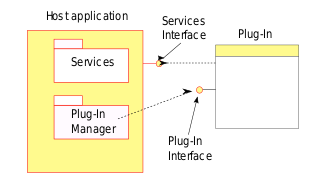

<!--
 * @Author: jinde.zgm
 * @Date: 2021-03-09 21:47:58
 * @Description: 调度插件代码解析
-->

# 前言

下图是维基百科关于[Plug-in (computing)](https://en.wikipedia.org/wiki/Plug-in_%28computing%29)示例插件框架，关于插件机制实现的原理不了解的读者可以看看，本文不赘述了。


但是上图中几个知识点本文会提及，所以此处重点说明一下：

1. 宿主应用(Host Application): kube-scheduler就是宿主应用，因为所有插件都是给kube-scheduler使用的。
2. 插件管理器(Plugin Manager): 原理上讲Scheduling Profile(后文会有介绍)充当了插件管理器的角色，因为它可以配置使能/禁止插件的使用。
3. 插件接口(Plugin Interface): kube-scheduler抽象了调度框架（framework），将调度分为不同的阶段(phase)，每个阶段都定义了一种插件接口。
4. 服务接口(Services Interface): kube-scheduler在创建插件的时候传入了FrameworkHandle，就是一种服务接口，插件通过FrameworkHandle可以获取Clientset和SharedInformerFactory，或者从Cache中读取数据。该句柄还将提供列举、批准或拒绝等待的Pod的接口。

本文内容参考了[Scheduling Framework](https://github.com/kubernetes/enhancements/blob/master/keps/sig-scheduling/624-scheduling-framework/README.md)，并结合源码解析kube-scheduler的插件实现。

本文引用源码为kubernetes的release-1.20分支。

# 插件状态

kube-scheduler中插件是无状态的，如果插件需要存储状态，则依赖外部实现。这就需要宿主应用为插件提供相关的能力，并以服务接口的形式开放给插件，比如插件A想引用插件B的输出数据。kube-scheduler的实现方法略有不同，开放给插件一个变量，该变量会在所有插件接口函数中引用，其实开放服务接口和开放变量本质上是一样的。现在来看看存储插件状态的类型定义：<https://github.com/kubernetes/kubernetes/blob/release-1.20/pkg/scheduler/framework/cycle_state.go#L44>

```go
// CycleState就是开放给所有插件共享使用的变量类型，从定义来看就是一个加了锁的map，可以理解为所有插件共享一个KV存储。
// 其中Cycle是什么意思？很简单，就是每调度一个Pod算周期，那么CycleState就是某一周期的状态。官方称之为Pod调度上下文。
type CycleState struct {
    mx      sync.RWMutex
    // StateKey和StateData的定义下面有注释
    // map[StateKey]StateData其实等同于map[string]interface{}，而这个interface{}具有克隆能力。
    // 这给插件实现非常大的扩展空间，基本想存什么就存什么。
    storage map[StateKey]StateData
    // 但凡有Metrics关键字，八九不离十都和prometheus的监控相关
    recordPluginMetrics bool
}

// StateKey就是字符串
type StateKey string

// StateData就是具有拷贝能力（可以是深度复制，也可以不是）的interface{}
type StateData interface {
    Clone() StateData
}
```

# 插件类型

kube-scheduler将调度抽象为一种框架（framework），关于调度框架的解释请参看<https://kubernetes.io/zh/docs/concepts/scheduling-eviction/scheduling-framework/>，这对于理解本文非常重要，所以建议读者仔细阅读。

现在需要进入插件的定义，源码连接：<https://github.com/kubernetes/kubernetes/blob/release-1.20/pkg/scheduler/framework/interface.go#L226>

```go
// 从Plugin的定义可以看出，所有的插件都必须有名字，感觉好有道理的样子。有句话怎么说来着：“字越少，事越大”！
// 至少知道一个事情，插件有名字，应该是唯一名字，否则出现重复就无法区分彼此了。
type Plugin interface {
    Name() string
}
```

别看Plugin本身没什么功能，那是因为framework为每个阶段定义了相应的插件功能，而这些插件接口都继承了Plugin。笔者按照framework的调度流程先后顺序依次介绍各种插件。

## QueueSortPlugin

### QueueSortPlugin定义

还记得[调度队列](./SchedulingQueue.md)中提到过的lessFunc么？引用的就是QueueSortPlugin.Less()接口。QueueSortPlugin插件是调度队列用来按照指定规则排序Pod时使用的，比如按照优先级排序。源码连接：<https://github.com/kubernetes/kubernetes/blob/release-1.20/pkg/scheduler/framework/interface.go#L237>

```go
type QueueSortPlugin interface {
    Plugin
    // Less()的定义是不是跟调度队列的lessFunc一模一样？有关排序的原理读者可以自行学习堆排序，亦或是查看srot.Sort()接口的使用方法。
    Less(*QueuedPodInfo, *QueuedPodInfo) bool
}
```

### QueueSortPlugin实现

QueueSortPlugin插件实现只有PrioritySort，按照Pod的优先级从高到底排序。因为只有PrioritySort一种实现，所以没得选择(笔者注：一个插件接口可以有多种实现)。源码连接：<https://github.com/kubernetes/kubernetes/blob/release-1.20/pkg/scheduler/framework/plugins/queuesort/priority_sort.go#L41>

```go
// Less()实现了QueueSortPlugin.Less()接口。
func (pl *PrioritySort) Less(pInfo1, pInfo2 *framework.QueuedPodInfo) bool {
    // PodPriority函数获取Pod的优先级Pod.Spec.Priority，如果为空则优先级为0
    p1 := corev1helpers.PodPriority(pInfo1.Pod)
    p2 := corev1helpers.PodPriority(pInfo2.Pod)
    // 值越大优先级越高，如果优先级相同，则创建时间早的优先级高。
    return (p1 > p2) || (p1 == p2 && pInfo1.Timestamp.Before(pInfo2.Timestamp))
}
```

## PreFilterPlugin

### PreFilterPlugin定义

这里需要简单说明一下FilterPlugin是用来过滤掉无法运行Pod的Node，这个概念在kube-scheduler中曾经被称为‘predicate’。PreFilter不是预过滤，而是过滤前处理，后面章节的PostFilter就是过滤后处理。笔者不是咬文嚼字，因为预过滤有过滤的能力，而过滤前处理是为过滤做准备工作，二者意义不同。

过滤前处理主要是为了过滤准备数据，并将数据存储在CycleState中供FilterPlugin使用。源码连接：<https://github.com/kubernetes/kubernetes/blob/release-1.20/pkg/scheduler/framework/interface.go#L257>

```go
type PreFilterPlugin interface {
    Plugin
    // state前面已经说明了，用来存储插件状态的，除此之外，PreFilter()的参数只需要Pod。
    // 所以PreFilter()只能计算一些与Pod相关的数据，这也直接的证明了不是预过滤，因为预过滤应该需要Node。
    // PreFilter()处理的数据会存储在state中供FilterPlugin使用，这样的解释符合前处理的定义。
    PreFilter(ctx context.Context, state *CycleState, p *v1.Pod) *Status
    // 过滤前处理扩展接口，PreFilterExtensions类型下面有注释。这里需要思考一个问题：为什么单独返回一个接口而不是在当前的接口扩展函数？
    // 本质上讲，返回一个扩展接口和在当前接口扩展函数是一样的，而这种设计的目的是：
    // 1. 扩展接口可能不是运行在过滤前处理阶段；
    // 2. 扩展接口需要影响到过滤前处理的结果，否则就称不上过滤前处理的扩展接口了；
    // 上面的解释读者可能不太理解，这部分会在解析调度框架(framework)相关的文章中说明，但是笔者给出上面的解释也是可以说的通的。
    // 说的准确一点就是在过滤前处理与过滤处理之间会调用扩展接口更新前处理的数据，然后再为过滤提供依据。
    PreFilterExtensions() PreFilterExtensions
}

// 过滤前处理插件扩展接口
type PreFilterExtensions interface {
    // 尝试评估将podToAdd添加到Node后对调度podToSchedule的影响时，会调用这个接口
    AddPod(ctx context.Context, state *CycleState, podToSchedule *v1.Pod, podToAdd *v1.Pod, nodeInfo *NodeInfo) *Status
    // 尝试评估从Node删除podToRemove后对调度podToSchedule的影响时，会调用这个接口
    RemovePod(ctx context.Context, state *CycleState, podToSchedule *v1.Pod, podToRemove *v1.Pod, nodeInfo *NodeInfo) *Status
}
```

那么问题来了，为什么不在FilterPlugin做PreFilterPlugin的处理，非要在PreFilterPlugin中处理放到CycleState中，然后FilterPlugin再取出来呢？PreFilterPlugin这个插件真的有必要存在么？答案是肯定的，原因有两个：

1. PreFilterExtensions.AddPod()会造成PreFilterPlugin计算的状态更新，所以在FilterPlugin取出的数据并不是PreFilterPlugin计算出来的结果。那什么时候会调用PreFilterExtensions？还记得[PodNominator](./PodNominator.md)么？他记录了所有抢占还未调度的Pod，调度器在过滤之前需要假设这些Pod已经放置到了指定的Node上，就会调用PreFilterExtensions.AddPod()接口更新状态。
2. 因为PreFilterPlugin可能会有很多个，每个PreFilterPlugin.PreFilter()都有可能出错，如果最后一个插件在执行PreFilterPlugin.PreFilter()处理的时候出错，那么前面所有插件执行的过滤都白做了，所以把所有可能出错的过滤前处理都放在PreFilterPlugin里，这会减少不必要的计算。

以上均为笔者自行理解，不代表官方意见。

### PreFilterPlugin实现

PreFilterPlugin插件的实现以及他们的功能如下：

1. InterPodAffinity: 实现Pod之间的亲和性和反亲和性，InterPodAffinity实现了PreFilterExtensions，因为抢占调度的Pod可能与当前的Pod具有亲和性或者反亲和性；
2. NodePorts: 检查Pod请求的端口在Node是否可用，NodePorts未实现PreFilterExtensions;
3. NodeResourcesFit: 检查Node是否拥有Pod请求的所有资源，NodeResourcesFit未实现PreFilterEtensions;
4. PodTopologySpread: 实现Pod拓扑分布，关于Pod拓扑分布的解释请查看：<https://kubernetes.io/zh/docs/concepts/workloads/pods/pod-topology-spread-constraints/>，PodTopologySpread实现了PreFilterExtensions接口，因为抢占调度的Pod可能会影响Pod的拓扑分布；
5. ServiceAffinity: 检查属于某个服务(Service)的Pod与配置的标签所定义的Node集合是否适配，这个插件还支持将属于某个服务的Pod分散到各个Node，ServiceAffinity实现了PreFilterExtensions接口；
6. VolumeBinding: 检查Node是否有请求的卷，是否可以绑定请求的卷，VolumeBinding未实现PreFilterExtensions接口；

本文选择NodeResourcesFit作为示例分析PreFilterPlugin的实现，因为资源适配绝大部分调度系统都有，更容易理解，源码连接：<https://github.com/kubernetes/kubernetes/blob/release-1.20/pkg/scheduler/framework//plugins/noderesources/fit.go#L168>

```go
// PreFilter实现来了PreFilterPlugin.PreFilter()接口
func (f *Fit) PreFilter(ctx context.Context, cycleState *framework.CycleState, pod *v1.Pod) *framework.Status {
    // 仅仅是在CycleState记录了Pod的资源需求，computePodResourceRequest见下面注释
    cycleState.Write(preFilterStateKey, computePodResourceRequest(pod))
    return nil
}

func computePodResourceRequest(pod *v1.Pod) *preFilterState {
    // 关于preFilterState的定义建议读者自己查看，此处只需要知道他用来统计Pod资源需求量
    result := &preFilterState{}
    for _, container := range pod.Spec.Containers {
        result.Add(container.Resources.Requests)
    }

    // 所有资源需求量与InitContainers的资源需求量取最大值，这个比较好理解，毕竟二者是错时运行的
    for _, container := range pod.Spec.InitContainers {
        result.SetMaxResource(container.Resources.Requests)
    }

    // 累加Pod开销
    // 关于Pod开销请查看链接：https://kubernetes.io/zh/docs/concepts/scheduling-eviction/pod-overhead/
    if pod.Spec.Overhead != nil && utilfeature.DefaultFeatureGate.Enabled(features.PodOverhead) {
        result.Add(pod.Spec.Overhead)
    }

    return result
}
```

因为NodeResourcesFit没有实现PreFilterExtensions，所以没有相关的代码注释，读者可以选择实现了PreFilterExtensions的插件自行分析源码。本文的目标是尽量用少的文字将调度插件解释清楚。

## FilterPlugin

### FilterPlugin定义

过滤插件用于过滤不能运行该Pod的Node，源码链接：<https://github.com/kubernetes/kubernetes/blob/release-1.20/pkg/scheduler/framework/interface.go#L273>

```go
type FilterPlugin interface {
    Plugin
    // 判断Pod是否可以调度到Node上
    Filter(ctx context.Context, state *CycleState, pod *v1.Pod, nodeInfo *NodeInfo) *Status
}
```

### FilterPlugin实现

FilterPlugin插件的实现以及它们的功能如下：

1. InterPodAffinity: 实现Pod之间的亲和性和反亲和性；
2. NodeAffinity: 实现了Node[选择器](https://kubernetes.io/zh/docs/concepts/scheduling-eviction/assign-pod-node/#nodeselector)和[节点亲和性](https://kubernetes.io/zh/docs/concepts/scheduling-eviction/assign-pod-node/#node-affinity)
3. NodeLabel: 根据配置的标签过滤Node；
4. NodeName: 检查Pod指定的Node名称与当前Node是否匹配；
5. NodePorts: 检查Pod请求的端口在Node是否可用；
6. NodeResourcesFit: 检查Node是否拥有Pod请求的所有资源；
7. NodeUnscheduleable: 过滤Node.Spec.Unschedulable值为true的Node；
8. NodeVolumeLimits: 检查Node是否满足CSI卷限制；
9. PodTopologySpread: 实现Pod拓扑分布;
10. ServiceAffinity: 检查属于某个服务(Service)的Pod与配置的标签所定义的Node集合是否适配，这个插件还支持将属于某个服务的Pod分散到各个Node；
11. TaintToleration: 实现了[污点和容忍度](https://kubernetes.io/zh/docs/concepts/scheduling-eviction/taint-adntoleration/)；
12. VolumeBinding: 检查Node是否有请求的卷，是否可以绑定请求的卷；
13. VolumeRestrictions: 检查挂载到Node上的卷是否满足卷Provider的限制；
14. VolumeZone: 检查请求的卷是否在任何区域都满足；

实现FilterPlugin的插件数量远多于PreFilterPlugin，说明有不少插件的前处理都放在FilterPlugin实现。这证明了前面笔者认为需要PreFilterPlugin的观点，就是有些过滤的前处理不会出错亦或抢占调度的Pod对于当前Pod没有影响，比如NodeUnscheduleable。
本文选择NodeResourcesFit作为示例，这样可以与PreFilterPlugin形成连续性。源码连接：<https://github.com/kubernetes/kubernetes/blob/release-1.20/pkg/scheduler/framework//plugins/noderesources/fit.go#L195>

```go
// Filter实现了FilterPlugin.Filter()接口
func (f *Fit) Filter(ctx context.Context, cycleState *framework.CycleState, pod *v1.Pod, nodeInfo *framework.NodeInfo) *framework.Status {
    // 获取PreFilter()计算的状态
    s, err := getPreFilterState(cycleState)
    if err != nil {
        return framework.NewStatus(framework.Error, err.Error())
    }

    // 从函数的返回值的名字可推断出来函数在计算有哪些资源无法满足Pod需求。
    // fitsRequest建议读者自己查看，代码虽然有点长，但是一点难度都没有，不适合放在文档中充数
    // 就是判断Node上剩余的资源是否满足Pod的需求，需要注意每个Node允许调度的Pod数量也是有限制的。
    insufficientResources := fitsRequest(s, nodeInfo, f.ignoredResources, f.ignoredResourceGroups)

    if len(insufficientResources) != 0 {
        // 记录所有失败的原因，即因为那些资源造成Pod无法调度到Node上
        failureReasons := make([]string, 0, len(insufficientResources))
        for _, r := range insufficientResources {
            failureReasons = append(failureReasons, r.Reason)
        }
        return framework.NewStatus(framework.Unschedulable, failureReasons...)
    }
    return nil
}
```

## PostFilterPlugin

### PostFilterPlugin定义

PostFilterPlugin插件在过滤后调用，但仅在Pod没有满足需求的Node时调用。典型的过滤后处理的实现是抢占，试图通过抢占其他Pod的资源使该Pod可以调度。源码连接：<https://github.com/kubernetes/kubernetes/blob/release-1.20/pkg/scheduler/framework/interface.go#L296>

```go
type PostFilterPlugin interface {
    Plugin
    // 这里有一个问题：为什么参数只有Pod而没有Node？道理很简单，所有的Node都已经被过滤掉了。
    // 所以只需要传入每个Node失败的原因，这样能有助于抢占调度的实现。
    PostFilter(ctx context.Context, state *CycleState, pod *v1.Pod, filteredNodeStatusMap NodeToStatusMap) (*PostFilterResult, *Status)
}
```

### PostFilterPlugin实现

过滤后处理只有DefaultPreemption一种实现，用来实现抢占调度。源码链接：<https://github.com/kubernetes/kubernetes/blob/release-1.20/pkg/scheduler/framework/plugins/defaultpreemption/default_preemption.go#L91>

```go
// PostFilter实现了PostFilterPlugin.PostFilter()接口
func (pl *DefaultPreemption) PostFilter(ctx context.Context, state *framework.CycleState, pod *v1.Pod, m framework.NodeToStatusMap) (*framework.PostFilterResult, *framework.Status) {
    preemptionStartTime := time.Now()
    defer func() {
        metrics.PreemptionAttempts.Inc()
        metrics.DeprecatedSchedulingAlgorithmPreemptionEvaluationDuration.Observe(metrics.SinceInSeconds(preemptionStartTime))
    }()

    // preempt()会返回合适的Node的名字，参数'm'记录了每个Node被过滤掉的原因，这样可以结合Node上已经运行Pod，就可以找到在哪个Node上抢占哪些Pod。
    nnn, err := pl.preempt(ctx, state, pod, m)
    if err != nil {
        return nil, framework.AsStatus(err)
    }
    // 如果没有找到合适的Node，则返回不可调度状态码
    if nnn == "" {
        return nil, framework.NewStatus(framework.Unschedulable)
    }
    return &framework.PostFilterResult{NominatedNodeName: nnn}, framework.NewStatus(framework.Success)
}
```

抢占调度是一个比较复杂的过程，笔者会单独写一个文章分析DefaultPreemption的实现，上面截取的源码只是为了说明PostFilterPlugin的一个也是唯一一个实现是DefaultPreemption。

## PreScorePlugin

### PreScorePlugin定义

PreScorePlugin是SocrePlugin的前处理，和过滤插件一样，主要是为了评分做准备工作。Filter是为了过滤掉无法满足Pod需求的Node，而Score是为了给满足Pod需求的Node评分，Node最终会调度到评分最高的Node上，也就是‘最适合’的Node。源码链接：<https://github.com/kubernetes/kubernetes/blob/release-1.20/pkg/scheduler/framework/interface.go#L315>

```go
type PreScorePlugin interface {
    Plugin
    // 参数nodes是所有过滤通过的Node，不再是全量的Node。
    PreScore(ctx context.Context, state *CycleState, pod *v1.Pod, nodes []*v1.Node) *Status
}
```

同样的道理，PreScorePlugin也是有必要的，因为有一些前处理可能会出错，而评分计算可能计算量比较大，如果去掉PreScorePlugin可能会造成大量的无效计算。例如：总共有10个插件，直到第十个插件在执行预处理的过程中出错，造成前面9个插件的评分计算无效。

### PreScorePlugin实现

PreScorePlugin插件的实现与它们的功能如下：

1. InterPodAffinity: 实现Pod之间的亲和性和反亲和性；
2. PodTopologySpread: 实现Pod拓扑分布；
3. SelectorSpread: 对于属于Services、ReplicaSets和StatefulSets的Pod，偏好跨多节点部署；
4. TaintToleration: 实现了[污点和容忍度](https://kubernetes.io/zh/docs/concepts/scheduling-eviction/taint-adntoleration/)；

本文选择的示例是TaintToleration，源码链接：<https://github.com/kubernetes/kubernetes/blob/release-1.20/pkg/scheduler/framework/plugins/tainttoleration/taint_toleration.go#L97>

```go
// PreScore实现了PreScorePlugin.PreScore()接口。
func (pl *TaintToleration) PreScore(ctx context.Context, cycleState *framework.CycleState, pod *v1.Pod, nodes []*v1.Node) *framework.Status {
    if len(nodes) == 0 {
        return nil
    }
    // 获取所有PreferNoSchedule类型的污点容忍度，容忍度是Pod指定的。getAllTolerationPreferNoSchedule()下面有注释。
    // 为什么没有NoSchedule和NoExecute？因为这两个是在FilterPlugin使用的，用来过滤无法容忍污点的Node。
    // 当前阶段的Node要么没有NoSchedule和NoExecute，要么能够容忍，所以只需要PreferNoSchedule类型的容忍度。
    tolerationsPreferNoSchedule := getAllTolerationPreferNoSchedule(pod.Spec.Tolerations)
    state := &preScoreState{
        tolerationsPreferNoSchedule: tolerationsPreferNoSchedule,
    }
    // 写入CycleState
    cycleState.Write(preScoreStateKey, state)
    return nil
}

func getAllTolerationPreferNoSchedule(tolerations []v1.Toleration) (tolerationList []v1.Toleration) {
    for _, toleration := range tolerations {
        // 有一种特殊的情况，就是容忍度的Effect为空，只需要匹配Key就可以，至于污点的Effect是什么都可以，包括PreferNoSchedule，所以需要考虑这种情况
        if len(toleration.Effect) == 0 || toleration.Effect == v1.TaintEffectPreferNoSchedule {
            tolerationList = append(tolerationList, toleration)
        }
    }
    return
}
```

有没有发现一个问题？貌似TaintToleration.PreScore()不会出错，为什么放在还要实现PreScorePlugin？笔者认为不用纠结于这个细节，原理上是需要PreScorePlugin是必须的，那么是否需要实现PreScorePlugin那就是插件自己决定的了，即便不会出错实现了也没什么不好，至少从语义上还是比较好理解的。

## ScorePlugin

### ScorePlugin定义

kube-scheduler会调用ScorePlugin对通过FilterPlugin的Node评分，所有ScorePlugin的评分都有一个明确的整数范围，比如[0, 100]，这个过程称之为标准化评分。在标准化评分之后，kube-scheduler将根据配置的插件权重合并所有插件的Node评分得出Node的最终评分。根据Node的最终评分对Node进行排序，得分最高者就是最合适Pod的Node。源码链接：<https://github.com/kubernetes/kubernetes/blob/release-1.20/pkg/scheduler/framework/interface.go#L333>

```go
type ScorePlugin interface {
    Plugin
    // 计算节点的评分，此时需要注意的是参数Node名字，而不是Node对象。
    // 如果实现了PreScorePlugin就从CycleState获取状态， 如果没实现，调度框架在创建插件的时候传入了句柄，可以获取指定的Node。
    // 返回值的评分是一个64位整数，是一个由插件自定义实现取值范围的分数。
    Score(ctx context.Context, state *CycleState, p *v1.Pod, nodeName string) (int64, *Status)
    // 返回ScoreExtensions接口，此类设计与PreFilterPlugin相似
    ScoreExtensions() ScoreExtensions
}

// ScorePlugin的扩展接口
type ScoreExtensions interface {
    // ScorePlugin().Score()返回的分数没有任何约束，但是多个ScorePlugin之间需要标准化分数范围，否则无法合并分数。
    // 比如ScorePluginA的分数范围是[0, 10]，ScorePluginB的分数范围是[0, 100]，那么ScorePluginA的分数再高对于ScorePluginB的影响也是非常有限的。
    NormalizeScore(ctx context.Context, state *CycleState, p *v1.Pod, scores NodeScoreList) *Status
}
```

### ScorePlugin实现

ScorePlugin插件的实现以及它们的功能如下：

1. ImageLocality: 选择已经存在Pod运行所需容器镜像的Node，这样可以省去下载镜像的过程，对于镜像非常大的容器是一个非常有价值的特性，因为启动时间可以节约几秒甚至是几十秒；
2. InterPodAffinity: 实现Pod之间的亲和性和反亲和性；
3. NodeAffinity: 实现了Node[选择器](https://kubernetes.io/zh/docs/concepts/scheduling-eviction/assign-pod-node/#nodeselector)和[节点亲和性](https://kubernetes.io/zh/docs/concepts/scheduling-eviction/assign-pod-node/#node-affinity)
4. NodeLabel: 根据配置的标签过滤Node；
5. NodePreferAvoidPods: 基于Node的[注解](https://kubernetes.io/zh/docs/concepts/overview/working-with-objects/annotations/) **scheduler.alpha.kubernetes.io/preferAvoidPods**打分；
6. NodeResourcesBalancedAllocation: 调度Pod时，选择资源分配更为均匀的Node；
7. NodeResourcesLeastAllocation: 调度Pod时，选择资源分配较少的Node；
8. NodeResourcesMostAllocation: 调度Pod时，选择资源分配较多的Node；
9. RequestedToCapacityRatio: 根据已分配资源的配置函数选择偏爱Node；
10. PodTopologySpread: 实现Pod拓扑分布；
11. SelectorSpread: 对于属于Services、ReplicaSets和StatefulSets的Pod，偏好跨多节点部署；
12. ServiceAffinity: 检查属于某个服务(Service)的Pod与配置的标签所定义的Node集合是否适配，这个插件还支持将属于某个服务的Pod分散到各个Node；
13. TaintToleration: 实现了[污点和容忍度](https://kubernetes.io/zh/docs/concepts/scheduling-eviction/taint-adntoleration/)；

为了保持与PreScorePlugin实现代码的连续性，本文选择的示例是TaintToleration，源码链接：<https://github.com/kubernetes/kubernetes/blob/release-1.20/pkg/scheduler/framework/plugins/tainttoleration/taint_toleration.go#L138>

```go
// Score()实现了ScorePlugin.Score()接口。
func (pl *TaintToleration) Score(ctx context.Context, state *framework.CycleState, pod *v1.Pod, nodeName string) (int64, *framework.Status) {
    // 获得NodeInfo，此处就是通过调度框架提供的句柄handle获取指定的Node
    nodeInfo, err := pl.handle.SnapshotSharedLister().NodeInfos().Get(nodeName)
    if err != nil || nodeInfo.Node() == nil {
        return 0, framework.AsStatus(fmt.Errorf("getting node %q from Snapshot: %w", nodeName, err))
    }
    node := nodeInfo.Node()

    // 获取PreScore()计算的状态
    s, err := getPreScoreState(state)
    if err != nil {
        return 0, framework.AsStatus(err)
    }

    // 建议充分阅读https://kubernetes.io/zh/docs/concepts/scheduling-eviction/taint-and-toleration，理解污点和容忍度，这会影响下面代码的理解。
    // 统计无法容忍的污点数量，从代码上看无法容忍的数量越多分数越高，这不是有问题么？无法容忍就代表尽量不要把Pod放置到Node上，应该分数更低才对啊。
    // 这就要继续看ScoreExtensions部分的实现了
    score := int64(countIntolerableTaintsPreferNoSchedule(node.Spec.Taints, s.tolerationsPreferNoSchedule))
    return score, nil
}

// NormalizeScore()实现了ScoreExtensions.NormalizeScore()接口。
func (pl *TaintToleration) NormalizeScore(ctx context.Context, _ *framework.CycleState, pod *v1.Pod, scores framework.NodeScoreList) *framework.Status {
    // pluginhelper.DefaultNormalizeScore()源码注释翻译如下：
    // 1. 生成可将分数标准化为[0, maxPriority(第一个参数)]的标准化分数，framework.MaxNodeScore为100，所以标准化分数范围是[0, 100]。
    // 2. 如果将reverse(第二个参数)设置为true，则通过maxPriority减去分数来翻转分数。
    // 因为在TaintToleration.NormalizeScore()翻转了分数，所以无法容忍的污点数量越多标准化分数越低
    return pluginhelper.DefaultNormalizeScore(framework.MaxNodeScore, true, scores)
}
```

从TaintToleration示例可以看出ScorePlugin.Score()返回的分数是一个由插件自定义的值，甚至是翻转值，这给插件实现比较大的自由度。

## ReservePlugin

### ReservePlugin定义

kube-scheduler实际将Pod绑定到其指定的Node之前调用ReservePlugin，它的存在是为了防止kube-scheduler在等待绑定的成功前出现争用的情况(因为绑定是异步执行的，调度下一个Pod可能发生在绑定完成之前)。所以ReservePlugin是维护运行时状态的插件，也称之为有状态插件。好像哪里不对，笔者前面说过插件是无状态的，怎么这里又有状态了？这里需要说明一点，此处的状态不是插件的状态，而是全局的状态，只是再调度过程中由某些插件维护而已。源码链接：<https://github.com/kubernetes/kubernetes/blob/release-1.20/pkg/scheduler/framework/interface.go#L350>

```go
type ReservePlugin interface {
    Plugin
    // 在绑定Pod到Node之前为Pod预留资源
    Reserve(ctx context.Context, state *CycleState, p *v1.Pod, nodeName string) *Status
    // 在Reserve()与绑定成功之间有任何错误恢复预留的资源
    Unreserve(ctx context.Context, state *CycleState, p *v1.Pod, nodeName string)
}
```

### ReservePlugin实现

ReservePlugin的实现只有VolumeBinding，用来实现PVC和PV绑定，众所周知PV是kubernetes的全局资源，不是某个插件自己的状态。关于PVC和PV的概念请查看链接：<https://kubernetes.io/zh/docs/concepts/storage/persistent-volumes/>。如果Pod声明了PVC，调度过程中需要找到匹配的PV，然后再完成绑定。想一想为什么只有PV，Node的CPU、内存什么的为什么不预留？因为这些是通过[调度缓存](./Cache)实现的预留。

因为只有VolumeBinding一个实现，本文也没得选了，源码链接：<https://github.com/kubernetes/kubernetes/blob/release-1.20/pkg/scheduler/framework/plugins/volumebinding/volume_binding.go#L218>

```go
// Reserve()实现了ReservePlugin.Reserve()接口。
func (pl *VolumeBinding) Reserve(ctx context.Context, cs *framework.CycleState, pod *v1.Pod, nodeName string) *framework.Status {
    // 获取存储在CycleState的状态，也就是Pod的PVC声明
    state, err := getStateData(cs)
    if err != nil {
        return framework.AsStatus(err)
    }
    podVolumes, ok := state.podVolumesByNode[nodeName]
    if ok {
        // AssumePodVolumes()会匹配未绑定的PVC和PV，假定PVC和PV绑定并更新PV缓存，这一点和调度缓存类似
        allBound, err := pl.Binder.AssumePodVolumes(pod, nodeName, podVolumes)
        if err != nil {
            return framework.AsStatus(err)
        }
        state.allBound = allBound
    } else {
        state.allBound = true
    }
    return nil
}

// Unreserve()实现了ReservePlugin.Unreserve()接口。
func (pl *VolumeBinding) Unreserve(ctx context.Context, cs *framework.CycleState, pod *v1.Pod, nodeName string) {
    // 获取存储在CycleState中的状态
    s, err := getStateData(cs)
    if err != nil {
        return
    }
    podVolumes, ok := s.podVolumesByNode[nodeName]
    if !ok {
        return
    }
    // 恢复假定绑定的PVC和PV
    pl.Binder.RevertAssumedPodVolumes(podVolumes)
    return
}
```

其实VolumeBinding不仅实现了实现了ReservePlugin，它还实现的插件和功能如下：

1. PreFilterPlugin: 在CycleState记录Pod的PVC；
2. FilterPlugin: 判断Node是否能够满足Pod的PVC；
3. ReservePlugin: 为Pod预留PV，亦或称之为假定(assume)绑定PVC和PV，此处的假定与Pod假定调度到Node类似；
4. PreBindPlugin: 执行PV和PVC绑定

## PermitPlugin

### PermitPlugin定义

PermitPlugin插件用于阻止或延迟Pod绑定，可以做以下三个事情之一：

1. approve: 所有PermitPlugin都批准了Pod后，Pod才可以绑定；
2. deny: 如果任何PermitPlugin拒绝Pod，将返回到调度队列，这将触发ReservePlugin.Unreserve()；
3. wait(带超时): 如果PermitPlugin返回‘wait’，则Pod将保持在许可阶段，直到插件批准它为止；如果超时，等待将变成拒绝，并将Pod返回到调度队列，同时触发ReservePlugin.Unreserve()；

PermitPlugin是在调度周期(调度框架将调度过程分为调度周期和绑定周期，详情参看调度框架)的最后一步执行，但是在许可阶段中的等待发生在绑定周期的开始，即PreBind插件执行之前。

源码链接：<https://github.com/kubernetes/kubernetes/blob/release-1.20/pkg/scheduler/framework/interface.go#L386>

```go
type PermitPlugin interface {
    Plugin
    Permit(ctx context.Context, state *CycleState, p *v1.Pod, nodeName string) (*Status, time.Duration)
}
```

非常遗憾的是kubernetes没有实现PermitPlugin，至少在<https://github.com/kubernetes/kubernetes/blob/release-1.20/pkg/scheduler/framework/plugins/>目录下没有插件实现Permit()接口。

## PreBindPlugin

### PreBindPlugin定义

PreBindPlugin插件用于执行绑定Pod之前所需要的工作，例如：可以设置网络卷并将其安装在目标Node上，然后在允许Pod在节点上运行。源码连接：<https://github.com/kubernetes/kubernetes/blob/release-1.20/pkg/scheduler/framework/interface.go#L366>

```go
type PreBindPlugin interface {
    Plugin
    PreBind(ctx context.Context, state *CycleState, p *v1.Pod, nodeName string) *Status
}
```

### PreBindPlugin实现

PreBindPlugin的实现只有VolumeBinding，用来实现PVC和PV绑定，关于PVC和PV的概念请查看链接：<https://kubernetes.io/zh/docs/concepts/storage/persistent-volumes/>。因为只有VolumeBinding一种实现，本文也没得选了。源码链接：<https://github.com/kubernetes/kubernetes/blob/release-1.20/pkg/scheduler/framework/plugins/volumebinding/volume_binding.go#L243>

```go
// PreBind()实现了PreBindPlugin.PreBind()接口
func (pl *VolumeBinding) PreBind(ctx context.Context, cs *framework.CycleState, pod *v1.Pod, nodeName string) *framework.Status {
    // 获取存储在CycleState的状态
    s, err := getStateData(cs)
    if err != nil {
        return framework.AsStatus(err)
    }
    // 如果所有的PVC和PV已经绑定完成直接OK
    if s.allBound {
        return nil
    }
    podVolumes, ok := s.podVolumesByNode[nodeName]
    if !ok {
        return framework.AsStatus(fmt.Errorf("no pod volumes found for node %q", nodeName))
    }
    // 绑定PVC和PV
    klog.V(5).Infof("Trying to bind volumes for pod \"%v/%v\"", pod.Namespace, pod.Name)
    err = pl.Binder.BindPodVolumes(pod, podVolumes)
    if err != nil {
        klog.V(1).Infof("Failed to bind volumes for pod \"%v/%v\": %v", pod.Namespace, pod.Name, err)
        return framework.AsStatus(err)
    }
    klog.V(5).Infof("Success binding volumes for pod \"%v/%v\"", pod.Namespace, pod.Name)
    return nil
}
```

这老多代码只有那么少的注释？因为PVC和PV绑定是一个单独的课题，不在这里细说，懂的都懂。

## BindPlugin

### BindPlugin定义

BindPlugin用于将Pod绑定到Node，在所有PreBind完成之前，不会调用BindPlugin。按照BindPlugin配置顺序调用，BindPlugin可以选择是否处理指定的Pod，如果选择处理Pod，则会跳过其余的插件。源码连接：<https://github.com/kubernetes/kubernetes/blob/release-1.20/pkg/scheduler/framework/interface.go#L399>

```go
type BindPlugin interface {
    Plugin
    Bind(ctx context.Context, state *CycleState, p *v1.Pod, nodeName string) *Status
}
```

### BindPlugin实现

BindPlugin的实现只有DefaultBinder一种，所以没得选择，源码链接：<https://github.com/kubernetes/kubernetes/blob/release-1.20/pkg/scheduler/framework/plugins/defaultbinder/default_binder.go#L50>

```go
// Bind()实现了BindPlugin.Bind()接口。
func (b DefaultBinder) Bind(ctx context.Context, state *framework.CycleState, p *v1.Pod, nodeName string) *framework.Status {
    klog.V(3).Infof("Attempting to bind %v/%v to %v", p.Namespace, p.Name, nodeName)
    binding := &v1.Binding{
        ObjectMeta: metav1.ObjectMeta{Namespace: p.Namespace, Name: p.Name, UID: p.UID},
        Target:     v1.ObjectReference{Kind: "Node", Name: nodeName},
    }
    // 利用Clientset提供的接口完成绑定，至于绑定的原理与实现笔者会单独写一篇文章。
    err := b.handle.ClientSet().CoreV1().Pods(binding.Namespace).Bind(ctx, binding, metav1.CreateOptions{})
    if err != nil {
        return framework.AsStatus(err)
    }
    return nil
}
```

## PostBindPlugin

### PostBindPlugin定义

成功绑定Pod后，将调用PostBindPlugin(比如用来清理关联的资源），绑定周期到此结束。源码链接：<https://github.com/kubernetes/kubernetes/blob/release-1.20/pkg/scheduler/framework/interface.go#L375>

```go
type PostBindPlugin interface {
    Plugin
    PostBind(ctx context.Context, state *CycleState, p *v1.Pod, nodeName string)
}
```

非常遗憾，kubernetes没有实现PostBindPlugin，至少在<https://github.com/kubernetes/kubernetes/blob/release-1.20/pkg/scheduler/framework/plugins/>目录下没有插件实现PostBind()接口。

# 插件注册表

所有的插件统一注册在runtime.Registry的对象中，源码链接：<https://github.com/kubernetes/kubernetes/blob/release-1.20/pkg/scheduler/framework/runtime/registry.go#L58>

```go
// 插件注册表就是插件名字与插件工厂的映射，也就是可以根据插件名字创建插件。
type Registry map[string]PluginFactory

// 插件工厂用来创建插件，创建插件需要输入插件配置参数和框架句柄，其中runtime.Object可以想象为interface{}，可以是结构。
// framework.Handle就是调度框架句柄，为插件开放的接口
type PluginFactory = func(configuration runtime.Object, f framework.Handle) (framework.Plugin, error)
```

kube-scheuler插件注册表是静态编译的，源码链接：<https://github.com/kubernetes/kubernetes/blob/release-1.20/pkg/scheduler/framework/plugins/registry.go#L46>

```go
// 构建插件注册表，代码很简单，需要注意，如果自行实现插件，需要到这里来注册
func NewInTreeRegistry() runtime.Registry {
    return runtime.Registry{
        selectorspread.Name:                        selectorspread.New,
        imagelocality.Name:                         imagelocality.New,
        tainttoleration.Name:                       tainttoleration.New,
        nodename.Name:                              nodename.New,
        nodeports.Name:                             nodeports.New,
        nodepreferavoidpods.Name:                   nodepreferavoidpods.New,
        nodeaffinity.Name:                          nodeaffinity.New,
        podtopologyspread.Name:                     podtopologyspread.New,
        nodeunschedulable.Name:                     nodeunschedulable.New,
        noderesources.FitName:                      noderesources.NewFit,
        noderesources.BalancedAllocationName:       noderesources.NewBalancedAllocation,
        noderesources.MostAllocatedName:            noderesources.NewMostAllocated,
        noderesources.LeastAllocatedName:           noderesources.NewLeastAllocated,
        noderesources.RequestedToCapacityRatioName: noderesources.NewRequestedToCapacityRatio,
        volumebinding.Name:                         volumebinding.New,
        volumerestrictions.Name:                    volumerestrictions.New,
        volumezone.Name:                            volumezone.New,
        nodevolumelimits.CSIName:                   nodevolumelimits.NewCSI,
        nodevolumelimits.EBSName:                   nodevolumelimits.NewEBS,
        nodevolumelimits.GCEPDName:                 nodevolumelimits.NewGCEPD,
        nodevolumelimits.AzureDiskName:             nodevolumelimits.NewAzureDisk,
        nodevolumelimits.CinderName:                nodevolumelimits.NewCinder,
        interpodaffinity.Name:                      interpodaffinity.New,
        nodelabel.Name:                             nodelabel.New,
        serviceaffinity.Name:                       serviceaffinity.New,
        queuesort.Name:                             queuesort.New,
        defaultbinder.Name:                         defaultbinder.New,
        defaultpreemption.Name:                     defaultpreemption.New,
    }
}
```

# 插件配置

kube-scheduler当前支持三种方式(原理上是两种：1.Provider;2.Policy，只是Policy有两种而已)配置插件：

1. Provider: 源于<https://github.com/kubernetes/kubernetes/blob/release-1.20/pkg/scheduler/algorithmprovider/registry.go>中已注册的Provider;
2. File: 从文件中读取配置；
3. ConfigMap: 从ConfigMap中读取配置，这个是笔者比较喜欢的方法，也是笔者实际项目中习惯用的方法；

支持3中配置方式的源码链接：<https://github.com/kubernetes/kubernetes/blob/release-1.20/pkg/scheduler/scheduler.go#L234>

```go
switch {
    case source.Provider != nil:
        // 通过Provider创建配置
        sc, err := configurator.createFromProvider(*source.Provider)
        if err != nil {
            return nil, fmt.Errorf("couldn't create scheduler using provider %q: %v", *source.Provider, err)
        }
        sched = sc
    case source.Policy != nil:
        // 通过用户指定的policy源创建配置
        policy := &schedulerapi.Policy{}
        switch {
        // 通过文件创建配置
        case source.Policy.File != nil:
            if err := initPolicyFromFile(source.Policy.File.Path, policy); err != nil {
                return nil, err
            }
        // 通过ConfigMap创建配置
        case source.Policy.ConfigMap != nil:
            if err := initPolicyFromConfigMap(client, source.Policy.ConfigMap, policy); err != nil {
                return nil, err
            }
        }
        ...
    default:
        return nil, fmt.Errorf("unsupported algorithm source: %v", source)
    }
```

虽然有三种配置方法，那具体都配置什么呢？则就要引入[Scheduling Profile](https://v1-18.docs.kubernetes.io/docs/reference/scheduling/profiles)概念，不了解的同学建议点看链接了解一下。如果实在不想了解，就简单理解为kube-scheduler内部运行着多个不同配置的调度器，每个调度器有一个名字，调度器是通过Scheduling Profile配置的。关于Scheduling Profile的定义，源码链接：<https://github.com/kubernetes/kubernetes/blob/release-1.20/pkg/scheduler/apis/config/types.go#L115>

```go
type KubeSchedulerProfile struct {
    // 调度器名字
    SchedulerName string

    // 指定应启用或禁止的插件集合，下面有代码注释
    Plugins *Plugins

    // 一组可选的自定义插件参数，无参数等于使用该插件的默认参数
    PluginConfig []PluginConfig
}

// Plugins包含了各个阶段插件的配置，PluginSet见下面代码注释
type Plugins struct {
    QueueSort *PluginSet
    PreFilter *PluginSet
    Filter *PluginSet
    PostFilter *PluginSet
    PreScore *PluginSet
    Score *PluginSet
    Reserve *PluginSet
    Permit *PluginSet
    PreBind *PluginSet
    Bind *PluginSet
    PostBind *PluginSet
}

type PluginSet struct {
    // 指定默认插件外还应启用的插件，这些将在默认插件之后以此处指定的顺序调用
    Enabled []Plugin
    // 指定应禁用的默认插件，当需要禁用所有的默认插件时，应提供仅包含一个"*"的数组
    Disabled []Plugin
}

type Plugin struct {
    // 插件名字
    Name string
    // 插件的权重，仅用于ScorePlugin插件
    Weight int32
}

type PluginConfig struct {
    // 插件名字
    Name string
    // 插件初始化时的参数，可以是任意结构
    Args runtime.Object
}
```

上面提到了好多次默认插件，那么默认插件是什么？Provider和Policy都有一套默认插件，本文引用Provider的默认插件配置，因为它比较简单。源码链接：<https://github.com/kubernetes/kubernetes/blob/release-1.20/pkg/scheduler/algorithmprovider/registery.go#L71>

```go
// 代码不需要写注释了，因为实在是太简单了
func getDefaultConfig() *schedulerapi.Plugins {
    return &schedulerapi.Plugins{
        QueueSort: &schedulerapi.PluginSet{
            Enabled: []schedulerapi.Plugin{
                {Name: queuesort.Name},
            },
        },
        PreFilter: &schedulerapi.PluginSet{
            Enabled: []schedulerapi.Plugin{
                {Name: noderesources.FitName},
                {Name: nodeports.Name},
                {Name: podtopologyspread.Name},
                {Name: interpodaffinity.Name},
                {Name: volumebinding.Name},
            },
        },
        Filter: &schedulerapi.PluginSet{
            Enabled: []schedulerapi.Plugin{
                {Name: nodeunschedulable.Name},
                {Name: nodename.Name},
                {Name: tainttoleration.Name},
                {Name: nodeaffinity.Name},
                {Name: nodeports.Name},
                {Name: noderesources.FitName},
                {Name: volumerestrictions.Name},
                {Name: nodevolumelimits.EBSName},
                {Name: nodevolumelimits.GCEPDName},
                {Name: nodevolumelimits.CSIName},
                {Name: nodevolumelimits.AzureDiskName},
                {Name: volumebinding.Name},
                {Name: volumezone.Name},
                {Name: podtopologyspread.Name},
                {Name: interpodaffinity.Name},
            },
        },
        PostFilter: &schedulerapi.PluginSet{
            Enabled: []schedulerapi.Plugin{
                {Name: defaultpreemption.Name},
            },
        },
        PreScore: &schedulerapi.PluginSet{
            Enabled: []schedulerapi.Plugin{
                {Name: interpodaffinity.Name},
                {Name: podtopologyspread.Name},
                {Name: tainttoleration.Name},
            },
        },
        Score: &schedulerapi.PluginSet{
            Enabled: []schedulerapi.Plugin{
                {Name: noderesources.BalancedAllocationName, Weight: 1},
                {Name: imagelocality.Name, Weight: 1},
                {Name: interpodaffinity.Name, Weight: 1},
                {Name: noderesources.LeastAllocatedName, Weight: 1},
                {Name: nodeaffinity.Name, Weight: 1},
                {Name: nodepreferavoidpods.Name, Weight: 10000},
                // Weight is doubled because:
                // - This is a score coming from user preference.
                // - It makes its signal comparable to NodeResourcesLeastAllocated.
                {Name: podtopologyspread.Name, Weight: 2},
                {Name: tainttoleration.Name, Weight: 1},
            },
        },
        Reserve: &schedulerapi.PluginSet{
            Enabled: []schedulerapi.Plugin{
                {Name: volumebinding.Name},
            },
        },
        PreBind: &schedulerapi.PluginSet{
            Enabled: []schedulerapi.Plugin{
                {Name: volumebinding.Name},
            },
        },
        Bind: &schedulerapi.PluginSet{
            Enabled: []schedulerapi.Plugin{
                {Name: defaultbinder.Name},
            },
        },
    }
}
```

需要注意的是Provider只有默认配置一个，名字叫做‘DefaultProvider’。Policy的默认配置插件源码链接：<https://github.com/kubernetes/kubernetes/blob/release-1.20/pkg/scheduler/framework/plugins/legacy_registry.go#L181>,感兴趣的读者自行阅读。

# 总结

1. 从调度队列的排序到最终Pod绑定到Node，整个过程分为QueueSortPlugin、PreFilterPlugin、FilterPlugin、PostFilterPlugin、PreScorePlugin、ScorePlugin、ReservePlugin、PermitPlugin、PreBindPlugin、BindPlugin、PostBindPlugin总共11个接口，官方称这些接口为调度框架的11个扩展点，可以按需扩展调度能力；
2. 每种类型的插件可以有多种实现，比如PreFiltePlugin就有InterPodAffinity、PodTopologySpread、SelectorSpread和TaintToleration 4种实现，每种实现都对应一种调度需求；
3. 一个类型可以实现多种类型插件接口（多继承），比如VolumeBinding就实现了PreFilterPlugin、FilterPlugin、ReservePlugin和PreBindPlugin 4种插件接口，因为PVC与PV绑定需要在调度过程的不同阶段做不同的事情；
4. 所有插件都需要静态编译注册到注册表中，可以通过Provider、Policy(File、ConfigMap)方式配置插件；
5. 每个配置都有一个名字，对应一个Scheduling Profile，调度Pod的时候可以指定调度器名字；
