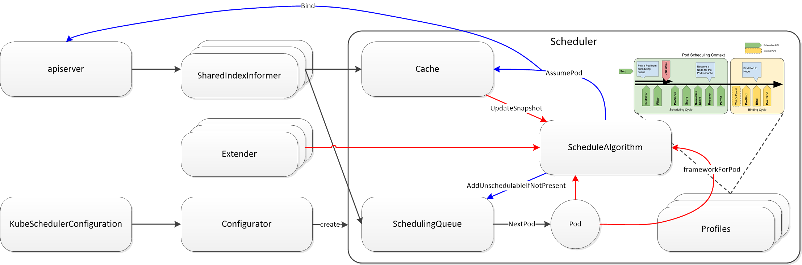

<!--
 * @Author: jinde.zgm
 * @Date: 2021-02-27 10:15:21
 * @Description: kube-scheduler源码解析
-->

1. 利用SharedIndedInformer过滤未调度的Pod放入[调度队列](./SchedulingQueue.md)
2. 利用SharedIndexInformer过滤已调度的Pod更新[调度缓存](./Cache.md)
3. 从[调度队列](./SchedulingQueue.md)取出一个待调度的Pod，通过Pod.Spec.SchedulerName获取[调度框架](./Framework.md)
4. [调度框架](./Framework.md)是配置好的[调度插件](./Plugin.md)集合，既可以通过扩展[调度插件](./Plugin.md)的方式扩展调度能力，也可以通过[调度扩展器](./Extender.md)
5. [调度算法](./ScheduleAlgorithm.md)利用[调度缓存](./Cache.md)的快照以及输入的[调度框架](./Framework.md)，为Pod选择最优的节点
6. 如果[调度算法](./ScheduleAlgorithm.md)执行失败，将Pod放入[调度队列](./SchedulingQueue.md)的不可调度自队列；如果[调度算法](./ScheduleAlgorithm.md)执行成功，通知[调度缓存](./Cache.md)假定调度Pod后异步绑定，绑定成功执行2
7. 其实[调度算法](./ScheduleAlgorithm.md)并不是执行失败就将Pod放入不可调度队列，而是通过[调度插件](./Plugin.md)执行抢占调度，抢占成功的Pod会被[提名](./PodNominator.md)并等待被强占调度Pod退出，只有抢占失败的Pod才会放入不可调度队列
8. 而且Pod假定调度完成后，不是立刻执行绑定，而是需要经过[调度插件](./Plugin.md)的ReservePlug和PermitPlugin，如果PermitPlugin返回等待，则Pod需要[等待](./WaitingPods.md)直到批准或超时
9.  向SharedIndedInformer注册了Pod、Node、Service、CSINode、PV、PVC、StorageClass[事件处理函数](./EventHandlers.md)
10. 以上调度流程通过[调度器](./Scheduler.md)对象实现，而[调度器](./Scheduler.md)是通过[配置器](./Configurator.md)构造的，[配置器](./Configurator.md)的配置主要来自[配置API](./KubeSchedulerConfiguration.md)
