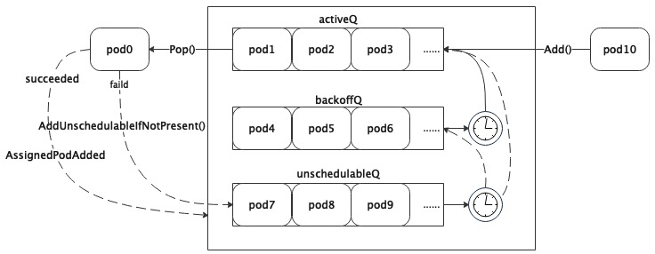

<!--
 * @Author: jinde.zgm
 * @Date: 2021-02-27 10:41:57
 * @Description: SchedulingQueue源码解析
-->

# 前言

到今天为止，笔者从事集群调度领域大约有7年多。突然想看看kubernetes的调度器是如何实现的，主要还是抱着学习的态度，看看kubernetes的调度实现在自己的工作中是否有可借鉴的地方。

调度设计一般缺少不了队列的设计，好的队列设计会让调度事半功倍。所以本文以调度队列为突破口，研究调度队列的设计与实现，为后续深入理解调度器的实现做准备。理解调度队列的设计，多半都能推导出调度器的实现，因为调度器的本质就是从队列中取出、决策（放置）然后再送到另一个队列的过程。

有一点读者需要知道，虽然kubernetes中有各种各样的workload，例如Job、Deployment、StatefulSet、DaemonSet等等。但是kube-scheduler调度的对象是Pod，其他各种workload都是在Pod基础上的封装。比如Job是具有定时执行能力的Pod，Deployment是多副本Pod（其实是ReplicaSet），StatefulSet不仅是多副本Pod并且之间还有一定的状态，DaemonSet则让所有的Node上都要有一个Pod。所以，当看到调度队列只有Pod一种对象的时候不要怀疑，因为这些workload是通过controller控制的。

本文采用的源码是kubenretes的release-1.20分支。

# 调度队列

## 调度队列中的Pod

虽然kubernetes定义了Pod的API对象(<https://github.com/kubernetes/api/blob/release-1.20/core/v1/types.go#L3664>)，但是它只定义了Pod本身的属性，而Pod在调度队列中的属性是没有的，所以就有了QueuedPodInfo（代码链接：<https://github.com/kubernetes/kubernetes/blob/release-1.20/pkg/scheduler/framework/types.go#L43>）：

```go
// QueuedPodInfo是在Pod的API对象基础上增加了一些与调度队列相关的变量，所以在调度队列中管理的Pod对象是QueuedPodInfo类型的
type QueuedPodInfo struct {
    // 继承Pod的API类型
    Pod *v1.Pod
    // Pod添加到调度队列的时间。因为Pod可能会频繁的从调度队列中取出(用于调度)然后再放入调度队列(不可调度)
    // 所以每次进入队列时都会记录入队列的时间，这个时间作用很大，后面在分析调度队列的实现的时候会提到。
    Timestamp time.Time
    // Pod尝试调度的次数。应该说，正常的情况下Pod一次就会调度成功，但是在一些异常情况下（比如资源不足），Pod可能会被尝试调度多次
    Attempts int
    // Pod第一次添加到调度队列的时间，Pod调度成功前可能会多次加回队列，这个变量可以用来计算Pod的调度延迟（即从Pod入队到最终调度成功所用时间）
    InitialAttemptTimestamp time.Time
}
```

## 堆（Heap）

这里提到的堆与排序有关，总所周知，golang的快排采用的是堆排序。所以不要与内存管理中"堆"概念混淆。

在kube-scheduler中，堆既有map的高效检索能力，有具备slice的顺序，这对于调度队列来说非常关键。因为调度对象随时可能添加、删除、更新，需要有高效的检索能力快速找到对象，map非常适合。但是golang中的map是无序的，访问map还有一定的随机性（每次range的第一个对象是随机的）。而调度经常会因为优先级、时间、依赖等原因需要对对象排序，slice非常合适，所以就有了堆这个类型。代码链接：<https://github.com/kubernetes/kubernetes/blob/release-1.20/pkg/scheduler/internal/heap/heap.go#L127>

```go
// Heap定义
type Heap struct {
    // Heap继承了data
    data *data
    // 监控相关，与本文内容无关
    metricRecorder metrics.MetricRecorder
}
// data是Heap核心实现
type data struct {
    // 用map管理所有对象
    items map[string]*heapItem
    // 在用slice管理所有对象的key，对象的key就是Pod的namespace+name，这是在kubernetes下唯一键
    queue []string
 
    // 获取对象key的函数，毕竟对象是interface{}类型的
    keyFunc KeyFunc
    // 判断两个对象哪个小的函数，了解sort.Sort()的读者此时应该能够猜到它是用来排序的。
    // 所以可以推断出来queue中key是根据lessFunc排过序的，而lessFunc又是传入进来的，
    // 这让Heap中对象的序可定制，这个非常有价值，非常有用
    lessFunc lessFunc
}
// 堆存储对象的定义
type heapItem struct {
    obj   interface{} // 对象，更准确的说应该是指针，应用在调度队列中就是*QueuedPodInfo
    index int         // Heap.queue的索引
}
```

本文不会对堆做详细的介绍，从堆的定义基本能够看出它的功能，所以没必要再做多余的解释（感兴趣的读者可以自行了解），因为后文中引用了堆，所以本章节简单介绍它的功能，方便后续章节的理解。

## 不可调度队列(UnschedulablePodsMap)

不可调度队列(UnschedulablePodsMap)管理暂时无法被调度（比如没有满足要求的Node）的Pod。虽然叫队列，其实是map实现，队列本质就是排队的缓冲，他与数据结构中的queue不是一个概念。代码链接：<https://github.com/kubernetes/kubernetes/blob/release-1.20/pkg/scheduler/internal/queue/scheduling_queue.go#L665>

```go
// 不可调度Pod的队列，就是对map的一种封装，可以简单的把它理解为map就可以了
type UnschedulablePodsMap struct {
    // 本质就是一个map，keyFunc与堆一样，用来获取对象的key
    podInfoMap map[string]*framework.QueuedPodInfo
    keyFunc    func(*v1.Pod) string
    // 监控相关，与本文内容无关
    metricRecorder metrics.MetricRecorder
}
```

## 调度队列的抽象

golang开发习惯是用interface抽象一种接口，然后在用struct实现该接口。kube-scheduler对于调度队列也是有它的抽象，如下代码所示(<https://github.com/kubernetes/kubernetes/blob/release-1.20/pkg/scheduler/internal/queue/scheduling_queue.go#L67>)：

```go
type SchedulingQueue interface {
    // PodNominator其实与调度队列的功能关系不大，但是Pod在调度队列中的状态变化需要同步给PodNominator。
    // 本文不对PodNominator做详细说明，在其他后续分析调度器的文章中引用时再做说明。
    framework.PodNominator
    // 向队列中添加待调度的Pod，比如通过kubectl创建一个Pod时，kube-scheduler会通过该接口放入队列中.
    Add(pod *v1.Pod) error
    // 返回队列头部的pod，如果队列为空会被阻塞直到新的pod被添加到队列中.Add()和Pop()的组合有点数据结构中queue的感觉了，
    // 可能不是先入先出，这要通过lessFunc对Pod的进行排序，也就是本文后面提到的优先队列，按照Pod的优先级出队列。
    Pop() (*framework.QueuedPodInfo, error)
    // 首先需要理解什么是调度周期，kube-scheduler没调度一轮算作一个周期。向调度队列添加Pod不能算作一个调度周期，因为没有执行调度动作。
    // 只有从调度队列中弹出（Pop）才会执行调度动作，当然可能因为某些原因调度失败了，但是也算调度了一次，所以调度周期是在Pop()接口中统计的。
    // 每次pop一个pod就会加一，可以理解为调度队列的一种特殊的tick。用该接口可以获取当前的调度周期。
    SchedulingCycle() int64
    // 把无法调度的Pod添加回调度队列，前提条件是Pod不在调度队列中。podSchedulingCycle是通过调用SchedulingCycle（）返回的当前调度周期号。
    AddUnschedulableIfNotPresent(pod *framework.QueuedPodInfo, podSchedulingCycle int64) error
    // 更新pod
    Update(oldPod, newPod *v1.Pod) error
    // 删除pod
    Delete(pod *v1.Pod) error
    // 首选需要知道调度队列中至少包含activeQ和backoffQ，activeQ是所有ready等待调度的Pod，backoffQ是所有退避Pod。
    // 什么是退避？与退避三舍一个意思，退避的Pod不会被调度，即便优先级再高也没用。那退避到什么程度呢？调度队列用时间来衡量，比如1秒钟。
    // 对于kube-scheduler也是有退避策略的，退避时间按照尝试次数指数增长，但不是无限增长，有退避上限，默认的退避上限是10秒。
    // 在kube-scheduler中Pod退避的原因就是调度失败，退避就是为了减少无意义的频繁重试。
    // 把所有不可调度的Pod移到activeQ或者backoffQ中，至于哪些放到activeQ哪些放入backoffQ后面章节会有说明。
    MoveAllToActiveOrBackoffQueue(event string)
    // 当参数pod指向的Pod被调度后，把通过标签选择该Pod的所有不可调度的Pod移到activeQ，是不是有点绕？
    // 说的直白点就是当Pod1依赖(通过标签选择)Pod2时，在Pod2没有被调度前Pod1是不可调度的，当Pod2被调度后调度器就会调用该接口。
    AssignedPodAdded(pod *v1.Pod)
    // 与AssignedPodAdded一样，只是发生在更新时
    AssignedPodUpdated(pod *v1.Pod)
    // 获取所有挂起的Pod，其实就是队列中所有的Pod，因为调度队列中都是未调度（pending）的Pod
    PendingPods() []*v1.Pod
    // 关闭队列
    Close()
    // 获取队列中不可调度的pod数量
    NumUnschedulablePods() int
    // 启动协程管理队列
    Run()
}
```

## 优先队列(PriorityQueue)

优先队列（PriorityQueue）实现了调度队列（SchedulingQueue），优先队列的头部是优先级最高的挂起（Pending）Pod。优先队列有三个子队列：一个子队列包含准备好调度的Pod，称为activeQ（是堆类型）；另一个队列包含已尝试并且确定为不可调度的Pod，称为unschedulableQ（UnschedulablePodsMap）；第三个队列是backoffQ,包含从unschedulableQ移出的Pod，退避完成后的Pod将其移到activeQ。源码链接：<https://github.com/kubernetes/kubernetes/blob/release-1.20/pkg/scheduler/internal/queue/scheduling_queue.go#L113>

```go
type PriorityQueue struct {
    // 与本文无关
    framework.PodNominator
    // 这两个不解释了，比较简单
    stop  chan struct{}
    clock util.Clock
 
    // Pod的初始退避时间，默认值是1秒，可配置.当Pod调度失败后第一次的退避时间就是podInitialBackoffDuration。
     // 第二次尝试调度失败后的退避时间就是podInitialBackoffDuration*2，第三次是podInitialBackoffDuration*4以此类推
    podInitialBackoffDuration time.Duration
    // Pod的最大退避时间，默认值是10秒，可配置。因为退避时间随着尝试次数指数增长，这个变量就是退避时间的上限值
    podMaxBackoffDuration time.Duration
 
    lock sync.RWMutex
    cond sync.Cond
 
    // activeQ，是Heap类型，前面解释过了
    activeQ *heap.Heap
    // backoffQ，也是Heap类型
    podBackoffQ *heap.Heap
    // unschedulableQ，详情见前面章节
    unschedulableQ *UnschedulablePodsMap
    // 调度周期，在Pop()中自增，SchedulingCycle()获取这个值
    schedulingCycle int64
    // 这个变量以调度周期为tick，记录上一次调用MoveAllToActiveOrBackoffQueue()的调度周期。
    // 因为调用AddUnschedulableIfNotPresent()接口的时候需要提供调度周期，当调度周期小于moveRequestCycle时，
    // 说明该不可调度Pod应该也被挪走，只是在调用接口的时候抢锁晚于MoveAllToActiveOrBackoffQueue()。具体后面会有代码注释。
    moveRequestCycle int64
 
    closed bool
}
```

根据优先队列的定义基本能够设想到实现调度队列的方法，接下来看看优先队列的具体实现。

### Add

源码链接：<https://github.com/kubernetes/kubernetes/blob/release-1.20/pkg/scheduler/internal/queue/scheduling_queue.go#L248>

```go
func (p *PriorityQueue) Add(pod *v1.Pod) error {
    // 全程在锁的保护范围内，后续代码中都有相关的代码，不再赘述
    p.lock.Lock()
    defer p.lock.Unlock()
    // 把v1.Pod转成QueuedPodInfo，然后加入到activeQ。
    // 需要注意的是newQueuedPodInfo()会用当前时间设置pInfo.Timestamp和InitialAttemptTimestamp
    pInfo := p.newQueuedPodInfo(pod)
    if err := p.activeQ.Add(pInfo); err != nil {
        klog.Errorf("Error adding pod %v to the scheduling queue: %v", nsNameForPod(pod), err)
        return err
    }
    // 如果Pod在不可调度队列，那么从其中删除
    if p.unschedulableQ.get(pod) != nil {
        klog.Errorf("Error: pod %v is already in the unschedulable queue.", nsNameForPod(pod))
        p.unschedulableQ.delete(pod)
    }
    // 如果Pod在退避队列，那么从其中删除
    if err := p.podBackoffQ.Delete(pInfo); err == nil {
        klog.Errorf("Error: pod %v is already in the podBackoff queue.", nsNameForPod(pod))
    }
    // metrics和PodNominator与本文无关，后面章节不在注释
    metrics.SchedulerQueueIncomingPods.WithLabelValues("active", PodAdd).Inc(
    p.PodNominator.AddNominatedPod(pod, "")
    // 因为有新的Pod，所以需要唤醒所有被Pop()阻塞的协程，在注释Pop()的源码的时候会看到阻塞的部分。
    p.cond.Broadcast()
 
    return nil
}
```

### AddUnschedulableIfNotPresent

代码链接：<https://github.com/kubernetes/kubernetes/blob/release-1.20/pkg/scheduler/internal/queue/scheduling_queue.go#L297>

```go
// 如果调度队列中没有指定的不可调度的Pod，则将其加入调度队列。通常，PriorityQueue将无法调度的Pod放入`unschedulableQ`中。
// 但是，如果最近调用过MoveAllToActiveOrBackoffQueue()，则将pod放入`podBackoffQ`中。
func (p *PriorityQueue) AddUnschedulableIfNotPresent(pInfo *framework.QueuedPodInfo, podSchedulingCycle int64) error {
    p.lock.Lock()
    defer p.lock.Unlock()
    // 如果已经在不可调度队列存在，则返回错误
    pod := pInfo.Pod
    if p.unschedulableQ.get(pod) != nil {
        return fmt.Errorf("pod: %v is already present in unschedulable queue", nsNameForPod(pod))
    }
 
    // 更新Pod加入队列的时间戳，因为被重新加入队列。有没有感觉比较奇怪，为什么在此处更新时间戳，而不是在上面(判断不可调度队列之前)或者下面(判断退避队列之后)？
    // 在判断不可调度队列之前更新的话,如果已经在不可调度队列会有问题；在此处更新如果Pod已经在activeQ或者backoffQ会有问题，以backoffQ为例，
    // 因为更新后会让Pod退避继续延后，原本backoffQ中是按照退避完成时间排序，此处更新了相当于修改了退避时间，但是没有更新backoffQ中的排序。
    // 造成该Pod后面本应该退避完成了也只能等该Pod退避完后才能放到activeQ，具体可以参看flushBackoffQCompleted()的实现，后面章节会有这部分源码说明。
    // 笔者已经向社区提交BUG了！PR连接：https://github.com/kubernetes/kubernetes/pull/97302，并且已经被社区合并到了master分支
    pInfo.Timestamp = p.clock.Now()
    // 只要在activeQ或者podBackoffQ存在也返回错误，完全符合接口中IfNotPresent的定义
    if _, exists, _ := p.activeQ.Get(pInfo); exists {
        return fmt.Errorf("pod: %v is already present in the active queue", nsNameForPod(pod))
    }
    if _, exists, _ := p.podBackoffQ.Get(pInfo); exists {
        return fmt.Errorf("pod %v is already present in the backoff queue", nsNameForPod(pod))
    }
 
    // 此处就是判断该Pod是不是属于上次MoveAllToActiveOrBackoffQueue()的范围，如果是就把Pod放到退避队列，否则放到不可调度队列。
    // 为什么不判断是否应该放入activeQ？因为刚刚更新了入队时间，是不可能退避完成的，所以直接放入backoffQ没毛病。
    if p.moveRequestCycle >= podSchedulingCycle {
        if err := p.podBackoffQ.Add(pInfo); err != nil {
            return fmt.Errorf("error adding pod %v to the backoff queue: %v", pod.Name, err)
        }
        metrics.SchedulerQueueIncomingPods.WithLabelValues("backoff", ScheduleAttemptFailure).Inc()
    } else {
        p.unschedulableQ.addOrUpdate(pInfo)
        metrics.SchedulerQueueIncomingPods.WithLabelValues("unschedulable", ScheduleAttemptFailure).Inc()
    }
 
    p.PodNominator.AddNominatedPod(pod, "")
    return nil
}
```

### Pop

代码链接：<https://github.com/kubernetes/kubernetes/blob/release-1.20/pkg/scheduler/internal/queue/scheduling_queue.go#L378>

```go
// 从调度队列中弹出一个需要调度的Pod
func (p *PriorityQueue) Pop() (*framework.QueuedPodInfo, error) {
    p.lock.Lock()
    defer p.lock.Unlock()
    // 如果activeQ中没有Pod，则阻塞协程，当然如果调度队列已经关闭了除外。
    for p.activeQ.Len() == 0 {
        if p.closed {
            return nil, fmt.Errorf(queueClosed)
        }
        p.cond.Wait()
        // 为什么不再判断一下p.closed？必要性不大，因为后续的代码不会阻塞协程。
    }
    // 从activeQ弹出第一个Pod
    obj, err := p.activeQ.Pop()
    if err != nil {
        return nil, err
    }
    // 尝试调度的计数加1，调度周期加1，这些都比较容易理解
    pInfo := obj.(*framework.QueuedPodInfo)
    pInfo.Attempts++
    p.schedulingCycle++
    return pInfo, err
}
```

### Update

代码链接：<https://github.com/kubernetes/kubernetes/blob/release-1.20/pkg/scheduler/internal/queue/scheduling_queue.go#L417>

```go
func (p *PriorityQueue) Update(oldPod, newPod *v1.Pod) error {
    p.lock.Lock()
    defer p.lock.Unlock()
    // 更新Pod就需要先找到他在哪个子队列，但只有oldPod不为空才会在activeQ或者backoffQ查找，这是为什么？
    // 既然是更新oldPod就不应该为nil，笔者猜测是版本更新历史遗留问题，当前版本调用该接口的地方保证了oldPod肯定不为nil，详情参看下面如下代码链接
    // https://github.com/kubernetes/kubernetes/blob/release-1.19/pkg/scheduler/eventhandlers.go#L184
    if oldPod != nil {
        oldPodInfo := newQueuedPodInfoNoTimestamp(oldPod)
        // 如果Pod在activeQ中就更新它
        if oldPodInfo, exists, _ := p.activeQ.Get(oldPodInfo); exists {
            p.PodNominator.UpdateNominatedPod(oldPod, newPod)
            err := p.activeQ.Update(updatePod(oldPodInfo, newPod))
            return err
        }
        // 如果Pod在backoffQ中，就把他从backoffQ中移除，更新后放到activeQ中，并唤醒所有因为Pop()阻塞的协程。
        // 直接更新不行么？为什么需要从backoffQ移到activeQ？很简单，造成Pod退避的问题更新后可能就不存在了，所以立即再尝试调度一次。
        if oldPodInfo, exists, _ := p.podBackoffQ.Get(oldPodInfo); exists {
            p.PodNominator.UpdateNominatedPod(oldPod, newPod)
            p.podBackoffQ.Delete(oldPodInfo)
            err := p.activeQ.Add(updatePod(oldPodInfo, newPod))
            if err == nil {
                p.cond.Broadcast()
            }
            return err
        }
    }
 
    // 如果Pod在unschedulableQ中，则更新它。
    if usPodInfo := p.unschedulableQ.get(newPod); usPodInfo != nil {
        p.PodNominator.UpdateNominatedPod(oldPod, newPod)
        // 此处判断了Pod是否有更新，如果确实更新了就把他从unschedulableQ中移除，更新后放到activeQ中，道理和上面一样，不多说了。
        // 那么问题来了，为什么此处需要判断Pod是否确实更新了？为什么在backoffQ的处理代码中没有相应的判断？
        // 这就需要关联调度逻辑的上下文，等笔者分析调度器实现的文章再说明，此处先留一个坑。至少这个问题不影响本文的理解。
        if isPodUpdated(oldPod, newPod) {
            p.unschedulableQ.delete(usPodInfo.Pod)
            err := p.activeQ.Add(updatePod(usPodInfo, newPod))
            if err == nil {
                p.cond.Broadcast()
            }
            return err
        }
        // Pod没有实质的更新，那么就直接在unschedulableQ更新好了
        p.unschedulableQ.addOrUpdate(updatePod(usPodInfo, newPod))
        return nil
    }
    // 如果Pod没有在任何子队列中，那么就当新的Pod处理，为什么要有这个逻辑？
    // 1.正常的逻辑可能不会运行到这里，但是可能有某些异常情况，这里可以兜底，保证状态一致，没什么毛病。
    // 2.因为调度队列是支持并发的，在调用Update()的同时可能另一个协程刚刚删除了该Pod，更新其实就是覆盖，也约等于删除后添加。
    err := p.activeQ.Add(p.newQueuedPodInfo(newPod))
    if err == nil {
        p.PodNominator.AddNominatedPod(newPod, "")
        p.cond.Broadcast()
    }
    return err
}
```

### Delete

代码链接：<https://github.com/kubernetes/kubernetes/blob/release-1.20/pkg/scheduler/internal/queue/scheduling_queue.go#L468>

```go
func (p *PriorityQueue) Delete(pod *v1.Pod) error {
    p.lock.Lock()
    defer p.lock.Unlock()
    p.PodNominator.DeleteNominatedPodIfExists(pod)
    // 删除实现比较简单，就是先从activeQ删除，如果删除失败多半是不存在，那么再从backoffQ和unschedulableQ删除。
    // 其实还可以判断一次backoffQ的删除错误代码，如果不存在再从unschedulableQ删除，毕竟Pod只可能出现在3个子队列中的一个队列中。
    // 当前的实现也没有问题，代码显得更简练一点，无非是效率上差一点点而已，可以忽略
    err := p.activeQ.Delete(newQueuedPodInfoNoTimestamp(pod))
    if err != nil { 
        p.podBackoffQ.Delete(newQueuedPodInfoNoTimestamp(pod))
        p.unschedulableQ.delete(pod)
    }
    return nil
}
```

### MoveAllToActiveOrBackoffQueue

代码链接：<https://github.com/kubernetes/kubernetes/blob/release-1.20/pkg/scheduler/internal/queue/scheduling_queue.go#L500>

```go
func (p *PriorityQueue) MoveAllToActiveOrBackoffQueue(event string) {
    p.lock.Lock()
    defer p.lock.Unlock()
    // 把map变成slice
    unschedulablePods := make([]*framework.QueuedPodInfo, 0, len(p.unschedulableQ.podInfoMap))
    for _, pInfo := range p.unschedulableQ.podInfoMap {
        unschedulablePods = append(unschedulablePods, pInfo)
    }
    // 调用movePodsToActiveOrBackoffQueue把所有不可调度的Pod移到activeQ或者backoffQ.
    p.movePodsToActiveOrBackoffQueue(unschedulablePods, event)
}
// 把不可调度的Pod移到activeQ或者backoffQ
func (p *PriorityQueue) movePodsToActiveOrBackoffQueue(podInfoList []*framework.QueuedPodInfo, event string) {
    for _, pInfo := range podInfoList {
        pod := pInfo.Pod
        // 判断Pod当前是否需要退避(判断方法见下面)，如果退避就放在backoffQ，当然放失败了还得放回unschedulableQ
        if p.isPodBackingoff(pInfo) {
            if err := p.podBackoffQ.Add(pInfo); err != nil {
                klog.Errorf("Error adding pod %v to the backoff queue: %v", pod.Name, err)
            } else {
                metrics.SchedulerQueueIncomingPods.WithLabelValues("backoff", event).Inc()
                p.unschedulableQ.delete(pod)
            }
        } else {
            // Pod无需退避就放在activeQ，放失败了还得放回unschedulableQ
            if err := p.activeQ.Add(pInfo); err != nil {
                klog.Errorf("Error adding pod %v to the scheduling queue: %v", pod.Name, err)
            } else {
                metrics.SchedulerQueueIncomingPods.WithLabelValues("active", event).Inc()
                p.unschedulableQ.delete(pod)
            }
        }
    }
    // 记录上一次移动的调度周期，在AddUnschedulableIfNotPresent()中用到了，到这里就比较清晰了。
    p.moveRequestCycle = p.schedulingCycle
    // 唤醒所有被Pop阻塞的协程，因为可能有Pod放入了activeQ。
    // 笔者认为这个实现不是很理想，应该增加一个bool型的局部变量，当有任何Pod放入activeQ成功后将该变量设置为true，
    // 然后根据该bool变量决定是否环境阻塞的协程，这样可以避免无效的唤醒。
    p.cond.Broadcast()
}
// 判断Pod是否需要退避
func (p *PriorityQueue) isPodBackingoff(podInfo *framework.QueuedPodInfo) bool {
    // 获取Pod需要退避的时间(见下面)，如果退避完成时间比当前还要晚，那么就需要退避
    boTime := p.getBackoffTime(podInfo)
    return boTime.After(p.clock.Now())
}
// 获取Pod的退避时间
func (p *PriorityQueue) getBackoffTime(podInfo *framework.QueuedPodInfo) time.Time {
    // 计算退避时长(见下面)
    duration := p.calculateBackoffDuration(podInfo)
    // 在加入队列的时间基础上+退避时长就是Pod的退避完成时间
    backoffTime := podInfo.Timestamp.Add(duration)
    return backoffTime
}
// 计算Pod退避时长
func (p *PriorityQueue) calculateBackoffDuration(podInfo *framework.QueuedPodInfo) time.Duration {
    // 在初始退避时长基础上，每尝试调度一次就在退避时长基础上乘以2，如果超过最大退避时长则按照最大值退避。
    // 这种方法比较常见，比如网络通信中连接失败，每次失败都等待一段时间再尝试连接，等待时间就是按照2的指数增长直到最大值。
    // 但是有没有感觉代码实现有点呆呆的？为什么不用移位(p.podInitialBackoffDuration<<podInfo.Attempts)的方法计算？
    // 因为很可能podInfo.Attempts是一个非常大的值，移位后就变成0了。但是这种实现还是不优雅，笔者准备向社区提交一个优雅的实现~
    duration := p.podInitialBackoffDuration
    for i := 1; i < podInfo.Attempts; i++ {
        duration = duration * 2
        if duration > p.podMaxBackoffDuration {
            return p.podMaxBackoffDuration
        }
    }
    return duration
}
```

### PendingPods

代码链接：<https://github.com/kubernetes/kubernetes/blob/release-1.20/pkg/scheduler/internal/queue/scheduling_queue.go#L560>

```go
// PendingPods的实现就是把三个子队列的Pod放到一个slice里面返回，比较简单
func (p *PriorityQueue) PendingPods() []*v1.Pod {
    p.lock.RLock()
    defer p.lock.RUnlock()
    var result []*v1.Pod
    // 先导出activeQ中的Pod
    for _, pInfo := range p.activeQ.List() {
        result = append(result, pInfo.(*framework.QueuedPodInfo).Pod)
    }
    // 再导出backoffQ中的Pod
    for _, pInfo := range p.podBackoffQ.List() {
        result = append(result, pInfo.(*framework.QueuedPodInfo).Pod)
    }
    // 最后导出unschedulableQ中的Pod
    for _, pInfo := range p.unschedulableQ.podInfoMap {
        result = append(result, pInfo.Pod)
    }
    return result
}
```

### Run

代码链接：<https://github.com/kubernetes/kubernetes/blob/release-1.20/pkg/scheduler/internal/queue/scheduling_queue.go#L241>

```go
func (p *PriorityQueue) Run() {
    // 启动两个协程，一个定时刷backoffQ，一个定时刷unschedulableQ，至于wait.Until的实现读者自行了解，比较简单.
    // 为什么是两个协程，1个协程不行么？这个从两个协程的定时周期可以知道，不可调度的Pod刷新周期要远远低于退避协程.
    // 合成一个协程实现需要取最小刷新周期，如果不可调度Pod比较多，会带来很多无效的计算。
    go wait.Until(p.flushBackoffQCompleted, 1.0*time.Second, p.stop)
    go wait.Until(p.flushUnschedulableQLeftover, 30*time.Second, p.stop)
}
// 把所有退避完成的Pod放到activeQ
func (p *PriorityQueue) flushBackoffQCompleted() {
    p.lock.Lock()
    defer p.lock.Unlock()
    for {
        // 此处需要知道的是，退避队列是按照退避完成时间排序的队列，还记得Heap中的lessFunc么？退避队列的lessFunc就是比较退避完成时间
        // Peek是返回队列第一个Pod但不从队列中删除（类似于C++中std::vector::front()），如果队列中没有Pod就可以返回了
        rawPodInfo := p.podBackoffQ.Peek()
        if rawPodInfo == nil {
            return
        }
        // 如果第一个Pod的退避完成时间还没到，那么队列中的所有Pod也都没有完成退避，因为队列是按照退避完成时间排序的，这种队列比较常见，没什么解释的了。
        pod := rawPodInfo.(*framework.QueuedPodInfo).Pod
        boTime := p.getBackoffTime(rawPodInfo.(*framework.QueuedPodInfo))
        if boTime.After(p.clock.Now()) {
            return
        }
        // 弹出第一个Pod，因为Pod退避时间结束了
        _, err := p.podBackoffQ.Pop()
        if err != nil {
            klog.Errorf("Unable to pop pod %v from backoff queue despite backoff completion.", nsNameForPod(pod))
            return
        }
        // 把Pod加入activeQ
        p.activeQ.Add(rawPodInfo)
        metrics.SchedulerQueueIncomingPods.WithLabelValues("active", BackoffComplete).Inc()
        // 至少有一个Pod放入到了activeQ，所以函数退出时需要唤醒被阻塞的协程。
        // 问：p.cond.Broadcast()会被执行多少次？答：当然是循环到这里几次就执行几次。
        // 问：需要唤醒几次？答：一次就可以
        // 当然循环多次意味着一秒内有多个Pod可能完成退避，这个概率不大，所以也没有啥问题，即便唤醒多次也没什么大不了的。
        // 笔者是完美主义者，得向社区提交点东西刷刷存在感~
        defer p.cond.Broadcast()
    }
}
// 不可调度队列并不意味着Pod不再调度，kube-scheduler有一个不可调度的间隔，如果Pod放入unschedulableQ超过该时间间隔将会重新尝试调度
// 说的直白点，不可调度的Pod每隔unschedulableQTimeInterval(60秒，可以理解刷新周期是30秒了吧)还会再尝试调度的.
func (p *PriorityQueue) flushUnschedulableQLeftover() {
    p.lock.Lock()
    defer p.lock.Unlock()
 
    // 取出在unschedulableQ中呆的时间超过不可调度间隔的所有Pod
    var podsToMove []*framework.QueuedPodInfo
    currentTime := p.clock.Now()
    for _, pInfo := range p.unschedulableQ.podInfoMap {
        lastScheduleTime := pInfo.Timestamp
        if currentTime.Sub(lastScheduleTime) > unschedulableQTimeInterval {
            podsToMove = append(podsToMove, pInfo)
        }
    }
    // 然后将这些Pod放到activeQ或者backoffQ中
    if len(podsToMove) > 0 {
        // 这个函数在前面已经介绍了
        p.movePodsToActiveOrBackoffQueue(podsToMove, UnschedulableTimeout)
    }
}
```

### AssignedPodAdded/AssignedPodUpdated

代码链接：<https://github.com/kubernetes/kubernetes/blob/release-1.20/pkg/scheduler/internal/queue/scheduling_queue.go#L482>

```go
// 这两个函数最终都是调用movePodsToActiveOrBackoffQueue把需要的Pod放入activeQ或者backoffQ的。
// 什么是需要的？getUnschedulablePodsWithMatchingAffinityTerm()给出了答案，简单说就是Pod的亲和性与指定另一个Pod有关，
// 比如Pod1不能与指定标签的Pod2在同一个Node上，那么Pod2没调度，Pod1是不能调度的，比较好理解吧。
func (p *PriorityQueue) AssignedPodAdded(pod *v1.Pod) {
    p.lock.Lock()
    p.movePodsToActiveOrBackoffQueue(p.getUnschedulablePodsWithMatchingAffinityTerm(pod), AssignedPodAdd)
    p.lock.Unlock()
}
func (p *PriorityQueue) AssignedPodUpdated(pod *v1.Pod) {
    p.lock.Lock()
    p.movePodsToActiveOrBackoffQueue(p.getUnschedulablePodsWithMatchingAffinityTerm(pod), AssignedPodUpdate)
    p.lock.Unlock()
}
```

### 其他

PriorityQueue.Close()，PriorityQueue.NumUnschedulablePods()，PriorityQueue.SchedulingCycle()的实现过于简单，本文不做解释。

# 总结

还是供一个简单的图总结一下调度队列：


1. 虽然名字上叫做调度队列，但是实际上都是按照map组织的，其实map也是一种队列，只是序是按照对象的key排列的（需要注意的是golang中的map是无序的），此处需要与数据结构中介绍的queue区分开。在调度过程中会频繁的判断对象是否已经存在（有一个高大上的名字叫幂等）、是否不存在，从一个子队列挪到另一个子队列，伴随添加、删除、更新等操作，map相比于其他数据结构是有优势的。
2. 调度队列虽然用map组织了Pod，同时用Pod的key的slice对Pod进行排序，这样更有队列的样子了。
3. 调度队列分为三个自队列：
    1. activeQ：即ready队列，里面都是准备调度的Pod，新添加的Pod都会被放到该队列，从调度队列中弹出需要调度的Pod也是从该队列获取；
    2. unschedulableQ：不可调度队列，里面有各种原因造成无法被调度Pod，至于有哪些原因，笔者在分析调度器的文章中会说明；
    3. backoffQ：退避队列，里面都是需要可以调度但是需要退避一段时间后才能调度的Pod；
4. 新创建的Pod通过Add()接口将Pod放入activeQ。
调度器每调度一个Pod都需要调用Pop()接口获取一个Pod，如果调度失败需要调用AddUnschedulableIfNotPresent()把Pod返回到调度队列中，如果调度成功了调用AssignedPodAdded()把依赖的Pod从unschedulableQ挪到activeQ或者backoffQ。
5. 调度队列后台每30秒刷一次unschedulableQ，如果入队列已经超过unschedulableQTimeInterval(60秒)，则将Pod从unschedulableQ移到activeQ，当然，如果还在退避时间内，只能放入backoffQ。
6. 调度队列后台每1秒刷一次backoffQ，把退避完成的所有Pod从backoffQ移到activeQ。
7. 虽然调度队列的实现是优先队列，但是基本没看到优先级相关的内容，是因为创建优先队列的时候需要传入lessFunc，该函数决定了activeQ的顺序，也就是调度优先级。所以调度优先级是可自定义的。
8. Add()和AddUnschedulableIfNotPresent()会设置Pod入队列时间戳，这个时间戳会用来计算Pod的退避时间、不可调度时间。

问：默认的初始和最大退避时间是1秒和10秒，而unschedulableQTimeInterval是60秒。也就是说定时刷unschedulableQ都是找入队列60秒以上的Pod，肯定超过最大的退避时间10秒，肯定是放入activeQ，那还要backoffQ干什么？

答：1.初始和最大退避时间是可配置的；2.不可调度Pod不是只有后台刷一种激活方法，MoveAllToActiveOrBackoffQueue()，AssignedPodAdded()，AssignedPodUpdated()都会激活Pod。
