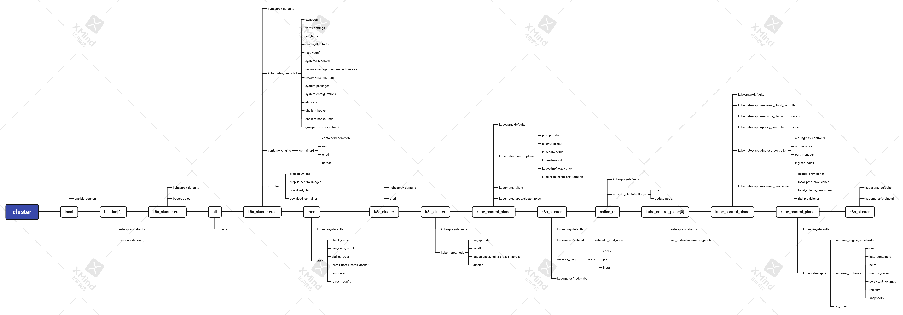

# 通过部署学习Kubernetes之新建集群

上图为kubespray安装一个kubernetes集群的流程图，其中主轴上每个节点代表一个阶段，而且节点内容为需要执行该阶段内容的及节点范围，其中：
- local为本机，即执行ansible-playbook命令的节点
- bastion为堡垒机
- k8s_cluster为kubernetes所有节点，包括kube_control_plane、worker和calico_rr节点
- kube_control_plane为控制平面节点
- etcd为etcd节点
- calico_rr为calico rr节点
- all是所有节点
- `[i]`表示节点改分组的第i个节点，比如bastion[0]为第1个堡垒机

1. [校验ansible版本](./ansible_version.md)，因为kubespray对于ansible的版本有一定的要求。
2. [堡垒机ssh配置](bastion-ssh-config/README.md)，前提条件是配置了堡垒机，而且需要注意的是，堡垒机只有第一个节点有用。
3. [引导kubernetes与etcd节点](kubernetes/bootstrap-os/READMD.md)，使得这些节点可以运行ansible模块，引导的主要工作为：
   1. 配置包管理器（比如配置yum源），以安装必要的包
   2. 安装Python
   3. 安装Ansible的包管理器模块必要的包
   4. 设置节点名字（hostname）
4. 搜集所有节点的信息。
5. 在kubernetes与etcd节点上执行[预安装]()、[安装容器引擎]()以及[下载]()必要的模块与镜像，因为安装kubernetes的组件有的是二进制，有的是镜像，所以在执行[下载]()之前需要提前安装容器引擎。
6. [安装etcd]()
7. 在kubernetes安装etcd客户端证书
8. 在kubernetes节点[安装kubelet]()
9. [安装控制平面]()
10. 在kubernetes节点[安装网络插件]()
11. [安装calico rr]()
12. 安装apps